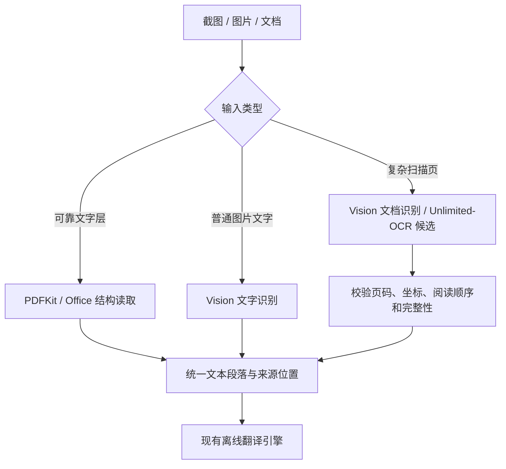

# Unlimited-OCR 技术评估

评估日期：2026-09-12  
适用产品：Mac 离线翻译器，包含文字、图片、文档和录音翻译；不包含理解与追问。  
评估性质：官方资料、论文、源码及社区适配审查。未在用户设备安装 Unlimited-OCR、下载完整权重或进行模型推理，因此没有本机准确性、延迟或峰值内存实测结果。

## 1. 结论

Unlimited-OCR 可以作为图片和扫描文档的 OCR / 版面解析引擎，能够替换一部分 Vision 文字识别及自建版面分析工作，但不适合全面替代现有方案。

推荐将其列为复杂扫描件、双栏学术页面、表格和公式较多页面的增强候选。普通截图优先使用 Apple Vision；有可靠文字层的 PDF 和 Office 文档优先直接提取文字。是否让 Unlimited-OCR 成为某类页面的默认引擎，应通过同批留学资料的本机对照评测决定。

Mac 接入路线有实际依据：Baidu 官方主仓库的教程面向 NVIDIA CUDA，但 MLX-VLM 已有专用 Unlimited-OCR 实现，包含多图输入和 R-SWA 缓存。优先验证该 MLX 路线，PyTorch MPS 补丁路线作为备选；不需要先为本项目自行完整移植 CUDA 实现。

一个重要补充：macOS 26 的 Vision 新增 RecognizeDocumentsRequest，已经支持结构化段落、列表和表格。用户当前系统满足版本要求，所以比较对象应包括这个原生接口，不能只与基础的逐行 OCR 比较。

## 2. 查阅范围和证据等级

| 来源 | 查阅内容 | 证据作用 |
| --- | --- | --- |
| Baidu 主仓库 | README、infer.py、LICENSE、目录树 | 官方输入、输出、部署路径和脚本行为 |
| 论文 | arXiv 2606.23050 v1 全文 | 模型结构、公开结果、长文能力与局限 |
| 官方指向的 ModelScope 模型仓库 | 模型卡、config.json、modeling_unlimitedocr.py、权重索引 | 模型许可证、CUDA 依赖、输出标记与权重大小 |
| MLX-VLM | 专用模型文档、unlimitedocr.py、language.py、项目元数据 | 验证 Mac 路线确有代码，支持多图和 R-SWA |
| 社区 PR / Issue | #56、#57、#18、#81，另查 Mac MLX 示例仓库 | 了解适配障碍和他人测试报告；不视为本机复现 |
| Apple 官方文档 | Vision 文字识别、RecognizeDocumentsRequest、DocumentObservation | 公平比较当前 macOS 的原生能力 |

Baidu 仓库评估基准：`d49ff64afffc1f47ab563dc1c589bc2f78808fa4`。  
MLX-VLM 源码查阅基准：`d2a1434a03e4c9975b0d505e7178e0cfc4082a83`。  
模型镜像文件使用评估当日的 `master` 内容；不假定与 GitHub 提交完全同步。Hugging Face 在本次访问中连接超时，因此模型文件资料通过项目官方指向的 ModelScope 仓库核对。

## 3. 它实际提供哪些能力

Unlimited-OCR 是文档图像解析模型，输入一张或多张图片，输出文字及结构标记。论文描述为约 3B 总参数、0.5B 激活参数的 MoE 模型；配置文件也包含 MoE 专家设置。vLLM 页面有简化模型标签，架构判断以论文和模型配置为准。

可以获取：

- 图片中的文字，以及文档元素的类型标记。
- 归一化区域坐标，常见范围为 0–1000。
- 适合后续转换成 Markdown 的文档内容，包括表格和公式等表示。
- 多页输出中的 `<PAGE>` 分隔标记。
- 模型预测的块顺序，可用于构建阅读顺序。

需要由应用补齐：

- 截图、文件选择和 PDF 页面渲染。
- 将输出校验并转换为可靠的页、段落、表格等数据结构。
- 中文翻译、中英对照、原页跳转、历史记录、任务恢复及导出。
- Word/PPT 的原始文件结构读取。

论文提到 R-SWA 将来可能用于 ASR 和翻译，是注意力机制的研究方向，不表示当前发布的 OCR 权重已经能替代语音识别或英中翻译模型。

## 4. 能替换哪些实现

| 当前方案中的部分 | 可替换程度 | 采用后的处理链与判断 |
| --- | --- | --- |
| Vision 图片文字识别 | 可以替换 | 图片 → Unlimited-OCR → 文字/结构块 → 现有翻译引擎；是否比原生更好需要实测 |
| 扫描 PDF 的 OCR | 可以替换 | PDFKit 渲染原页 → Unlimited-OCR → 页段对照与翻译 |
| 自建版面分组、阅读顺序、表格/公式提取 | 可以减少一部分工作 | 利用模型输出的元素、坐标和顺序；仍须校验和适配 |
| PDFKit 原页预览、渲染、跳转 | 不替换 | 官方 PDF 示例也先将 PDF 转成图片，再做 OCR |
| PDFKit 对可靠文字层的提取 | 通常保留 | 直接取得文件里的文字可避免视觉识别引入的错误；复杂顺序或损坏文字层再评估辅助 OCR |
| DOCX/PPTX XML 结构提取 | 通常保留 | 模型没有原生 DOCX/PPTX 对象接口；其中的图片文字可以交给 OCR |
| ScreenCaptureKit 截图 | 不替换 | OCR 接收图片，截屏仍由应用完成 |
| Ollama/Qwen 或 Apple Translation | 不替换 | 识别出的英文仍需要翻译引擎 |
| WhisperKit 录音转写 | 不替换 | 当前发布模型用于文档图像解析 |

不要为了统一入口而将所有 Word/PPT/PDF 都先截图再 OCR。这样会丢失原有的准确文字、标题/段落/单元格对应关系，并引入渲染成本与识别错误。仅在图像内容、损坏文字层或复杂结构确实需要时使用 OCR。

## 5. 与原有实现比较

| 比较维度 | Unlimited-OCR | Apple Vision / 原生文件提取 | 对本产品的含义 |
| --- | --- | --- | --- |
| 普通英文截图 | 可以识别，需加载视觉语言模型 | 原生文字识别直接可用，可返回文字位置与候选 | 普通截图暂保留原生默认，速度优势需要本机数据确认 |
| 复杂扫描页 | 提供文档元素、坐标、顺序及表格/公式表示，论文有专门评测 | 基础文字 OCR 需要附加结构处理；macOS 26 原生文档请求已提供段落、表格、列表 | 是最值得对照验证的场景，不能只用旧版 OCR 能力代表整个 Vision |
| 多页图像 | 支持多页共同输入、持续输出和页分隔 | 原生图像请求通常逐页处理，由应用调度 | 可以试验多页识别，但页码、遗漏检查、恢复机制仍由应用负责 |
| 数学公式 | 论文报告公式识别指标，可用于评估结构化公式提取 | 本次查阅的 Apple 文档接口未给出可直接对等的公式转 LaTeX 保证 | 公式页面是候选优势；首版仍允许保留公式原图 |
| 可靠文字层 | 需要经过渲染与识别 | PDFKit / OOXML 可直接取得文字和文件结构 | 直接提取一般更合适 |
| 运行资源 | 增加模型权重、推理环境和工作内存 | 使用系统框架，无需随应用分发这套大型 OCR 模型 | 需要把冷启动、内存、能耗纳入选型 |
| Mac 集成 | MLX-VLM 为 Python 接口，需应用管理运行环境或另做原生移植 | Swift 直接调用，权限、生命周期和打包较简单 | Unlimited-OCR 应作为独立可替换组件 |
| 离线 | 本地权重、配置、分词器、处理器与运行库准备完整后可在本机运行 | Vision 在设备内处理，仍需对选用接口实测断网路径 | 两者都可设计为离线；云演示不满足要求 |
| 可控性 | 可检查开源代码、固定版本和模型，但要承担适配维护 | 系统接口稳定性与升级由 Apple 管理，模型内部较少可控 | 根据实际质量收益决定额外维护是否值得 |

### 5.1 论文成绩应该怎样理解

论文报告 OmniDocBench v1.5 总分 93.23，DeepSeek-OCR 基线为 87.01；v1.6 总分为 93.92。该总分综合文字、公式、表格等任务，不是“任意文档识别正确率 93.92%”，也不是翻译准确率。

已查阅的论文未提供与 Apple Vision 的同设备、同数据集对照，因此不能据此断言 Unlimited-OCR 在用户的 Mac 上比 Vision 更准或更快。

论文中的 5,580 tokens/s 是特定并发条件下的总吞吐数据，其中注明 512 并发。它不能换算为用户单次截图的响应速度，也不代表 M5 Pro 的表现。

### 5.2 “Unlimited”的实际边界

R-SWA 保留图像/提示的前缀缓存，只为新生成的文字保留有限滑动窗口。因此，对于固定输入，解码历史的缓存不会随输出无限增长。

这不代表：输入页数无限、整机内存恒定、任意长书籍都能一次处理。论文明确说明 32K 上下文和图像前缀长度仍有限制；增加页面仍会增加前缀和图像处理开销。

多页模式采用 1024×1024 的全局图像模式，不使用单图的动态局部裁切。论文指出长文中的部分问题来自较小文字难以分辨。即使 PDF 先按 300 DPI 渲染，后续缩放也可能损失小字细节。

相对传统生成式 OCR，R-SWA 有缓存上的设计优势；相对逐页处理的 Apple Vision，不能直接声称更省内存。应用仍应限制批量页数，并为密集页面保留单页裁切识别的选项。

## 6. 当前 Mac 能否运行

### 6.1 官方直接部署路径

主 README 的 Transformers 示例使用 `.cuda()` 和 BF16；SGLang 示例使用 `fa3`，vLLM 部署例子是 NVIDIA GPU 镜像。模型源码也存在硬编码 CUDA 调用。Mac 的 Apple GPU 不支持 CUDA，安装 Docker 不能把这些 NVIDIA 镜像变成 Apple GPU 推理方案。

官方模型权重索引的 `total_size` 为 6,672,212,480 字节，约 6.67 GB。这只是权重数据，不包括图片、激活、缓存与运行库，不能用它推断峰值内存。

### 6.2 MLX 路线：优先验证

MLX-VLM 源码已有 `mlx_vlm/models/unlimited_ocr/`，包含：

- 专用模型与输入处理路径。
- 单提示多图输入的特征注入逻辑。
- `RingSlidingKVCache`，保留前缀并循环更新生成窗口。
- 官方单图和多页提示格式的对应实现。
- `gundam` 单图动态裁切与 `base` 多页全局模式。

这说明 Mac 可行性有具体实现依据。但不能仅把某个旧 DeepSeek-OCR 模型配置名称改掉，就假定算子、缓存、处理器和输出都正确。

社区已有 M4/M5 测试报告和 MLX 量化模型。用户的 M5 Pro / 48GB 在资源容量上具备验证价值；这些社区结果尚未在本机复现，不能作为首版性能承诺。

量化要与原始/较高精度版本对照。MLX 文档特别提醒视觉编码器精度降低可能影响识别、加剧循环；不为节省体积直接默认采用最激进的 4-bit 版本。

### 6.3 PyTorch MPS：备选

主仓库 PR #56、#57 提供 Mac 适配思路，查阅时尚未合并。社区报告包括：硬编码 CUDA、MPS 图像特征写入错误、自动混合精度引起的坐标重复，以及部分配置下中途崩溃。

这些报告说明简单替换 `.cuda()` 并不总能解决问题。相比维护多项补丁，优先评估已提供专用实现的 MLX 路线较合理。

## 7. 如果接入，建议如何实现

保持 SwiftUI/AppKit 主应用与现有翻译模块。新增一个可选的本地 OCR 工作进程，应用负责准备并管理 Python/MLX-VLM 运行环境，用户日常无需手动操作终端。

候选接入要求：

1. 固定 MLX-VLM 版本、模型版本、处理器、精度和提示格式。参考官方文档的任务提示作为基线；社区报告中有不同提示表现冲突的情况，应实测而非直接复制。
2. 使用显式本地模型目录，预备配置、分词器与处理器资源，启用所用库的离线选项，并真正断网测试。
3. 优先使用标准输入输出的结构化进程通信；若使用 HTTP，只绑定回环地址，避免沿用示例中的 `0.0.0.0`。
4. 保留原始 OCR 输出和定位元数据，解析为 `pageIndex / blockType / bbox / text / order / engineVersion / completionStatus`。不要先删除坐标再试图恢复原页位置。
5. 归一化坐标按实际页面尺寸、裁切和旋转转换；检验坐标范围、页分隔数量和元素完整性。
6. 处理输出截断、空结果、重复循环、异常页分隔、取消和恢复；失败页可回退到已验证的原生识别。
7. MLX-VLM 未自动附加 Unlimited-OCR 专用重复抑制器；如需要，显式实现并评测。抑制器也可能影响原文中合法重复内容，不能盲目调强。
8. 限制一次处理的页面数量。根据样本验证单页/小批次的质量与速度，再决定是否扩大多页任务。
9. 后处理采用严格的数值/结构解析。模型镜像示例存在 `eval` 解析输出的做法，不复制到正式应用；多页保存代码对 `<PAGE>` 也有假设，需要稳健处理。
10. OCR 工作进程按需加载和释放，与翻译及语音任务共同调度；防止三套模型同时长时间占用大量内存。

官方 GitHub LICENSE 为 MIT，ModelScope 模型卡也标注 MIT；接入时保留许可和署名。MLX-VLM 元数据同样标注 MIT。保留 PDFKit 渲染即可，不需要为采用该模型而整体复制其 PyMuPDF、SGLang 和演示应用依赖。

## 8. 决定是否采用所需的本机评测

以三个候选进行公平对照：基础 Vision 文字识别、macOS 26 Vision 文档识别、Unlimited-OCR 的固定 MLX 配置。

测试材料建议覆盖：普通英文截图、小字号课件、清晰/倾斜扫描件、双栏论文、表格、公式、中英混排，以及 10–20 页连续文档。对有文字层文件增加直接提取结果作为基准，不故意把所有输入都变成低质量截图。

比较内容：

- 文字错误和遗漏，特别是数字、单位、否定词、日期和专业词。
- 阅读顺序、段落边界、表格行列、公式内容、页码和坐标对应。
- 冷启动加载时间、预热后的单图时间、整份文档墙钟耗时。
- 峰值内存、长任务稳定性、取消/恢复、空结果与循环率。
- 同一翻译引擎下，最终译文受 OCR 错误影响的程度。
- 完整断网并重启应用后，所有过程能否完成。

耗时使用墙钟和真实 tokenizer 统计。官方 `infer.py` 的流处理代码按响应 chunk 累加“token”数量，chunk 与 tokenizer token 不必一一对应，不直接将其显示的 TPS 作为本机基准。

采用门槛：复杂页面上的识别/结构收益足以抵消额外加载、内存与维护成本，且在本机断网与长任务测试中稳定。通过后，可只替换相应类型页面的 OCR，不要求所有输入统一使用同一引擎。

## 9. 对当前规划的建议

- 保留 ScreenCaptureKit、PDFKit、Office 结构解析、翻译引擎和 WhisperKit。
- OCR 基线补充 macOS 26 的 RecognizeDocumentsRequest；如继续兼容 macOS 15，使用系统版本判断和基础 Vision 回退。
- Unlimited-OCR 加入 M0 的复杂图片/扫描文档候选，优先验证 MLX 实现。
- 当前不把它设为默认 OCR，不据论文分数或社区单个样例宣称优于原生方案。
- 该评估不增加理解、问答或知识解释功能；版面结构只用于准确提取、排序和定位待翻译文字。

## 10. 主要来源

1. [Baidu Unlimited-OCR README（评估提交）](https://github.com/baidu/Unlimited-OCR/blob/d49ff64afffc1f47ab563dc1c589bc2f78808fa4/README.md)
2. [官方 infer.py（评估提交）](https://github.com/baidu/Unlimited-OCR/blob/d49ff64afffc1f47ab563dc1c589bc2f78808fa4/infer.py)
3. [Unlimited OCR Works 论文](https://arxiv.org/html/2606.23050v1)
4. [vLLM 部署说明](https://recipes.vllm.ai/baidu/Unlimited-OCR)
5. [ModelScope 模型仓库](https://modelscope.cn/models/PaddlePaddle/Unlimited-OCR)
6. [ModelScope 模型源码](https://modelscope.cn/models/PaddlePaddle/Unlimited-OCR/resolve/master/modeling_unlimitedocr.py)
7. [MLX-VLM Unlimited-OCR 文档（评估提交）](https://github.com/Blaizzy/mlx-vlm/blob/d2a1434a03e4c9975b0d505e7178e0cfc4082a83/mlx_vlm/models/unlimited_ocr/README.md)
8. [MLX R-SWA 缓存实现](https://github.com/Blaizzy/mlx-vlm/blob/d2a1434a03e4c9975b0d505e7178e0cfc4082a83/mlx_vlm/models/unlimited_ocr/language.py)
9. [Mac 适配 PR #56](https://github.com/baidu/Unlimited-OCR/pull/56)、[PR #57](https://github.com/baidu/Unlimited-OCR/pull/57)
10. [MPS 空输出报告 #18](https://github.com/baidu/Unlimited-OCR/issues/18)、[运行中断报告 #81](https://github.com/baidu/Unlimited-OCR/issues/81)
11. [社区 M5 / MLX 配置与样例报告](https://github.com/will702/unlimited-ocr-mlx/blob/main/FINDINGS.md)
12. [Apple Vision 文字识别](https://developer.apple.com/documentation/vision/recognizing-text-in-images)
13. [Apple RecognizeDocumentsRequest](https://developer.apple.com/documentation/vision/recognizedocumentsrequest)
14. [Apple DocumentObservation.Container](https://developer.apple.com/documentation/vision/documentobservation/container)
