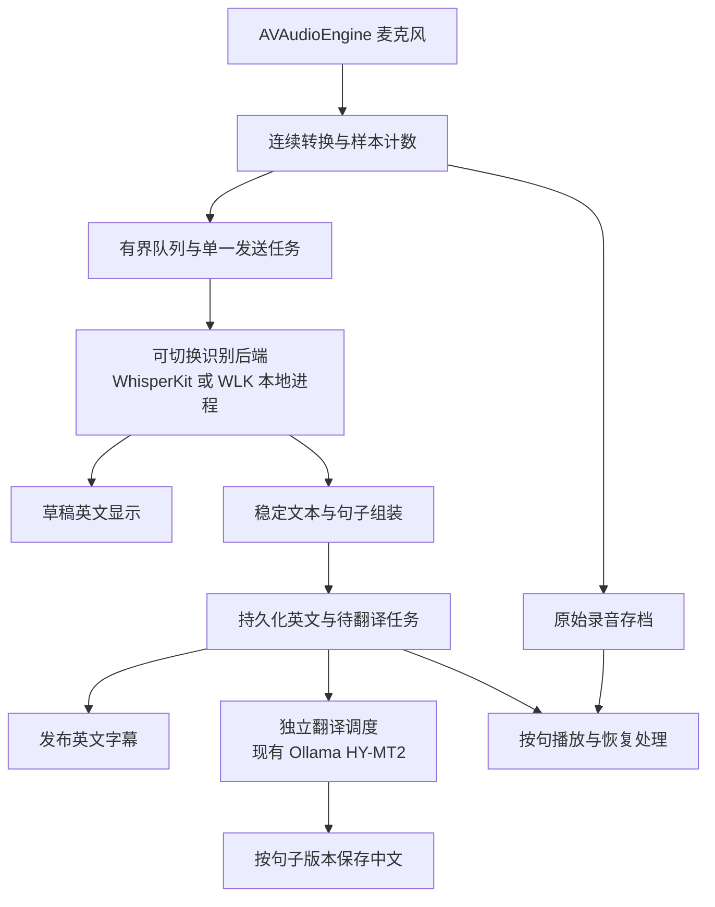

# WhisperLiveKit 技术评估与接入方案

评估日期：2026-09-15。对象：[QuentinFuxa/WhisperLiveKit](https://github.com/QuentinFuxa/WhisperLiveKit)，固定提交 [`363e4f6`](https://github.com/QuentinFuxa/WhisperLiveKit/commit/363e4f6d029694d9c81ae548beddd9d3c88a3637)，提交时间 2026-08-30 20:50 UTC，源码包版本 0.2.26，Apache-2.0。

**后续更新（2026-09-16 整理）：** 已完成真实 large-v3-turbo 的 MLX GPU 编码 + MPS GPU 解码 + SimulStreaming 进程内流式实测，包含 CPU/FP16 对照与停顿、EOF 检查；短样本尚未显示 MPS 提速。详见 [MPS 实测报告](WhisperLiveKit-MPS实测报告.md)。本文以下保留此前源码评估阶段的结论与验证范围；其中“尚未运行真实模型”描述的是该较早阶段。WebSocket、中文翻译和生产应用集成仍未完成。

## 1. 结论与当前决策

**值得引入为可切换的实验语音后端；正式采用前，需要完成本机同录音对照。** 它对当前的连续识别、跨窗口确认文本、停止时处理尾句、识别与翻译分工提供了可复用实现。当前证据还不足以认定它在本机比 WhisperKit 更快、更准确。

建议保留 SwiftUI 应用、现有 WhisperKit 基线、Ollama/HY-MT2 翻译与本地资源验证，增加一个隔离的 WhisperLiveKit 本地进程做比较。应用继续负责录音存档、句子与翻译任务持久化、重试、回放、人工纠错和导出。

影响选型的四项发现：

1. **它已经支持 HY-MT2-1.8B 的本地 MLX 翻译和英译中同时翻译配置。** 这与本项目模型方向吻合，但不能直接复用现有 Ollama GGUF 文件或其注意力校准。
2. **默认 Mac 识别路径有性能疑点。** `simulstreaming + mlx-whisper` 实际是 MLX 编码器与 PyTorch 解码器组合；后者默认 CUDA，否则 CPU。当前 Apple Silicon Mac 因而会使用 CPU 解码，不能按“全程 MLX”估计性能。
3. **已复现三项不满足本项目要求的行为。** LocalAgreement 可能吞掉快速、刻意的重复词；翻译分句会在 `Dr.` 和 `3.14` 处提前结束。它们是合成 token 输入的控制逻辑测试，尚不是课堂录音里的错误发生率。
4. **课堂资料的完整性仍需自己保障。** 队列关闭会清除待处理内容；`ready_to_stop` 也不等于所有中文翻译成功。它的会话内缓冲不替代本项目的持久化和录音恢复。

本轮交付为源码评估、可复现测试及接入设计。尚未把 WhisperLiveKit 接入生产应用，未下载它的模型，未执行它的真实识别或翻译推理。

## 2. 它对应的是哪些现有问题

当前实现见 `Sources/TranslatorCore/SpeechEngine.swift`，历史实测见 [M0 模型联调报告](M0模型联调报告.md)。

| 当前难题 | WhisperLiveKit 提供的能力 | 判断与边界 |
| --- | --- | --- |
| 独立 15 秒窗口切断退款条件句，可能漏词或重复 | 连续音频缓冲；LocalAgreement 比较相邻识别假设；SimulStreaming 用注意力决定输出时机 | 对症，值得测试。需要验证保留真正重复、窗口尾词与长停顿；不能保证完全无漏词 |
| 首条回放字幕约 16.54 秒后出现 | 小块输入、确认文本与草稿分开输出 | 可消除固定等满 15 秒这一项等待。新引擎的实际首条、稳定英文、完整中文延迟仍未测 |
| 英文必须等中文翻完才保存；翻译异常终止整个流程 | 识别、翻译独立任务与队列，单独暴露 `translation_error` | 架构可直接借鉴。生产流程仍须先保存英文和待翻译任务，再发布英文 |
| 模型输出的片段不等于语义完整句 | 按标点、停顿、换人或 EOF 触发翻译 | 有基础能力；简单标点规则不足以处理缩写、小数和依赖后半句的条件 |
| 尚无真实麦克风采集 | 附有 macOS Swift 采集与 WebSocket 示例，输出 16 kHz 单声道 PCM | 可参考采集格式和协议；仍需录音存盘、发送队列和错误处理 |
| 长课堂可能积压、资源持续增长 | 加权队列、容量限制、超时错误，diff 输出与历史裁剪 | 解决部分资源控制；关闭队列会丢弃未处理队列内容，原录音必须另存 |
| 中断后不能恢复；尚无按句播放和字幕导出闭环 | 有时间戳、内存状态、部分字幕格式工具 | 未发现满足本项目“原录音＋持久任务＋修改版本＋续跑”需求的现成闭环 |
| “至少提前 14 天”与“收到申请”误译 | 可换翻译后端，可把更完整的句子交给翻译 | 有助于减少碎片输入造成的错误；独立的翻译语义错误仍需模型和样本验收 |

历史的 26.113 秒合成音频、turbo + 1.8B 处理约 3.371 秒、首条约 16.54 秒等数字均来自此前报告，本轮没有重新测量。短样本吞吐不能替代 60–90 分钟课堂的积压和延迟分布。

## 3. Apple Silicon 实现：不能只看后端名称

### 3.1 默认 SimulStreaming 仍有 CPU 解码

源码调用链：`core.py → SimulStreamingASR → load_model()`。

- 默认 `backend_policy` 是 `simulstreaming`。
- `SimulStreamingASR` 将 `use_full_mlx` 默认为 `False`。
- 在 `encoder_backend == "mlx-whisper"` 路径，加载 MLX encoder 后，还调用 PyTorch `load_model()` 加载 decoder。
- 此调用未指定 device；内置 Whisper loader 的默认是 `cuda if available else cpu`。
- 源码注释写明全 MLX decoder 因标点后的 token 生成问题而默认关闭。
- 注释提到 `--use-full-mlx`，但本次固定版本的参数解析器中**没有这个选项**，配置与 `core.py` 也没有对应的正常传递入口。不能直接照注释写一条启动命令并宣称已启用。

这是代码路径判断，本轮没有运行该混合后端，不能据此给出慢多少的数字。它意味着：M5 Pro 上是否优于现有 Core ML WhisperKit，必须实测；全 MLX SimulStreaming 也不能作为已可直接使用的捷径。

后续针对 GPU 的补充验证：同日在本机 PyTorch 2.14.0 上，原始小型随机 Whisper decoder 的 MPS FP32/FP16、缓存、注意力和稀疏对齐头检查均通过。默认 CPU 选择可以通过设备配置适配，完整服务与真实模型尚待验证。更新后的加速实施建议见 [Mac GPU 加速补充](WhisperLiveKit-Mac-GPU加速补充.md)。

参考：[SimulStreaming 后端](https://github.com/QuentinFuxa/WhisperLiveKit/blob/363e4f6d029694d9c81ae548beddd9d3c88a3637/whisperlivekit/simul_whisper/backend.py)、[Whisper 模型加载](https://github.com/QuentinFuxa/WhisperLiveKit/blob/363e4f6d029694d9c81ae548beddd9d3c88a3637/whisperlivekit/whisper/__init__.py)、[配置](https://github.com/QuentinFuxa/WhisperLiveKit/blob/363e4f6d029694d9c81ae548beddd9d3c88a3637/whisperlivekit/config.py)。

### 3.2 LocalAgreement 可使用 MLX Whisper，但去重需要修正

`localagreement + mlx-whisper` 的识别通过 `mlx_whisper.transcribe` 执行，再用两次假设的公共前缀提交文本。它不依赖上述 SimulStreaming PyTorch decoder 路径，但整个服务的安装依赖仍包含 PyTorch。

`HypothesisBuffer.insert()` 在新词开始时间距离上次提交不足 1 秒时，对已提交后缀与新假设前缀做 1–5 词匹配。这可以消除重叠，也会混淆两次不同的发音。

复现案例：先提交 `very`（0.00–0.20 秒），再出现另一次 `very`（0.35–0.55 秒）和 `important`（0.60–0.90 秒）。两轮一致后只得到 `important`，第二个 `very` 被删除。

接入时需按时间对齐、重叠范围及词序区分“同一发音的重识别”与“新的重复发音”，同时保留重叠去重测试。这一结论只针对测试过的 LocalAgreement；本轮未证明默认 SimulStreaming 有同样的缺陷。

参考：[LocalAgreement 确认与去重](https://github.com/QuentinFuxa/WhisperLiveKit/blob/363e4f6d029694d9c81ae548beddd9d3c88a3637/whisperlivekit/local_agreement/online_asr.py)、[MLX Whisper 适配](https://github.com/QuentinFuxa/WhisperLiveKit/blob/363e4f6d029694d9c81ae548beddd9d3c88a3637/whisperlivekit/local_agreement/backends.py)。

## 4. HY-MT2 支持：可研究，暂不替换现有 Ollama

### 普通句子翻译

`mlx-llm-mt` 默认模型 profile 为 `hy-mt2-1.8b-8bit`，共享加载模型与推理锁，每个会话有自己的文本缓冲。完整句触发翻译，停顿、换人和 EOF 会提交未结束的尾句。失败句保存在内存中等待后续调用重试，成功句不会因这个重试重复输出。

本轮验证发现了两个相关边界：

- 句末判断来自 `TimedText.has_punctuation()`：词内任意位置有 `. ! ? 。！？` 就触发。因此 `Dr.` 与单个 ASR token `3.14` 都会提前触发翻译。应使用本项目的句子组装器处理缩写、小数、引号及连续条件句，并将停顿提交标成可修订片段。
- EOF 时翻译持续失败，翻译 worker 仍会返回，失败句留在其内存队列。WebSocket 的 `ready_to_stop` 代表处理流结束，不能据此把全部翻译任务标成成功。应用需继续显示待翻译/失败状态，并从持久记录重试。

当前 OllamaEngine 已有本机端点限制、模型元数据检查及输出未完成检测等项目约束。换成 MLX 后端需要重新对齐这些行为。更完整的原句可能改善翻译，但不能保证解决“收到/提出申请”和期限方向的错误。

### 同时翻译模式

上游另有 `--simultaneous`，利用翻译模型的注意力判断何时释放部分译文。附带的校准对象是：

- `mlx-community/Hy-MT2-1.8B-8bit`，**英语 → 中文**。
- 模型 revision：`f54bb3b8885363fd8b83d63d50b50a12a138321f`。
- 880 个标注对中使用 862 个；三个稳定性检查选出相同的八个注意力头。

这些数字衡量的是注意力对齐校准，**不是翻译准确率、实时率或本机字幕延迟**。校准必须匹配模型仓库、revision、量化、方向与聊天模板；不能套到现有 Ollama Q8_0 GGUF、4 bit 模型或反向翻译。当前只对 `hunyuan_v1_dense` 实现了相关捕获。

该模式的部分中文在一句话内增量增长，最终译文仍可替换先前部分译文。本项目允许等完整句，适合先验收整句翻译，再决定是否需要这种复杂度。

参考：[MLX 本地翻译说明](https://github.com/QuentinFuxa/WhisperLiveKit/blob/363e4f6d029694d9c81ae548beddd9d3c88a3637/docs/translation-mlx.md)、[翻译实现](https://github.com/QuentinFuxa/WhisperLiveKit/blob/363e4f6d029694d9c81ae548beddd9d3c88a3637/whisperlivekit/translation_mlx_llm_mt.py)、[同时翻译校准与限制](https://github.com/QuentinFuxa/WhisperLiveKit/blob/363e4f6d029694d9c81ae548beddd9d3c88a3637/docs/simul_mt_calibration.md)。

## 5. 三种融入方式

| 方案 | 可以复用什么 | 新增成本 | 建议 |
| --- | --- | --- | --- |
| 在 Swift/WhisperKit 中借鉴流式确认与队列设计 | 当前 Core ML 模型、原生运行时、本地验证体系 | 自行实现滚动识别、词时间对齐、确认与尾句处理；不能机械搬运已发现有问题的去重 | 保留为原生方案，尤其适合 WLK 本机性能不达标时 |
| **增加 WLK ASR 本地进程，现有 Ollama 负责翻译** | WLK 的语音管线；现有 UI、翻译模型及约束 | Python 环境、额外语音权重、WebSocket 适配、句子与持久化层；默认混合后端性能需测 | **推荐的第一项对照实验；通过验收后再作为可选正式后端** |
| WLK 负责识别与 HY-MT2 MLX 翻译 | 同一 Python 管线内的识别与翻译，并可研究同时翻译 | 额外 MLX 翻译权重与依赖、分句修复、翻译完整性约束、校准与质量复验 | 后续单独评估，当前没有证据证明收益足以支撑整体迁移 |

WhisperKit 的 `.mlmodelc` 不能直接交给 WLK 的 MLX/PyTorch loader；Ollama 的 GGUF 也不能直接交给 mlx-lm。即使都是 large-v3-turbo 或 HY-MT2-1.8B，运行时和文件格式仍不同。

依赖上，固定版本要求 Python `>=3.11,<3.14`；当前 Homebrew Python 3.14 不适用，但本机已有可用 Python 3.12。完整服务依赖含 PyTorch、torchaudio、faster-whisper 等；MLX 翻译 extra 使用 Transformers 5，与一些 Qwen3 extras 冲突，应只准备实际使用的后端。

## 6. 建议的应用接入边界

下面是待实现的设计，不是本轮已经接入的功能。

### 本地 WebSocket 原生协议

1. 应用启动自己拥有的本地服务进程，只绑定 `127.0.0.1`，确认模型与服务就绪后开始发送。
2. 原生端连接 `/asr?language=en&mode=diff`；短时协议探测也可先使用 full 模式。
3. 等待 `type=config`，确认 `useAudioWorklet=true` 对应服务以 PCM 输入方式启动。
4. 二进制输入为 **16,000 Hz、单声道、signed 16-bit little-endian PCM**，不带 WAV 文件头。发送只由一个顺序任务承担，原录音写入与发送状态分开计数。
5. 停止时先停止采集、排空转换器与发送队列，再发送一个**空二进制消息**，继续接收直到 `ready_to_stop` 或明确错误。
6. 无论正常结束、超时还是服务退出，都依据本地句子/翻译任务状态计算完成度；未完成音频从已保存录音恢复。

### 显示状态不能直接当作持久句子事件

`/asr` 的 `lines` 是当前显示状态，不包含本项目需要的稳定句子 ID、修改版本和持久确认号；最后一行仍可能增长或变化。`buffer_transcription` 是未确认文本，不能每次更新都新增永久句子或触发翻译。

建议适配层输出以下**本项目自定义事件**，需要实现映射或薄包装层，上游没有现成同名协议：

| 事件/字段 | 应用含义 |
| --- | --- |
| `sessionID + epoch + sequence` | 区分同一课堂的不同服务连接，检查顺序；不能把重连当原会话无缝继续 |
| `draftUpdated` | 替换暂存草稿，避免逐次追加 |
| `sentenceUpsert(id, sourceRevision, startSample, endSample, english, state)` | 保存稳定或最终句，句子 ID 不使用会变化的文本字符串生成 |
| `translationResult(id, sourceRevision, model, text, status)` | 只挂回对应英文版本，防止旧译文覆盖人工更正后的原文 |
| `inputEnded / asrEnded / translationPending / failed` | 分开表示采集、识别、翻译是否完成 |

严格的词级提交事件可在包装层从识别结果进入 `state.new_tokens` 的位置引出，须固定上游版本并覆盖正常输入、停顿和 EOF 路径。现有 `stream_event_queue` 主要报告语音/静音与音频进度，不是已具备上述持久句子契约的消息源。优先让短录音对照证明收益，再为正式后端完成该包装层。

### diff、队列及 Mac 示例需要补齐的地方

- **full 模式默认保留并发送全部历史**；diff 模式默认采用有限历史。长课堂应使用 diff 工作状态，应用另存完整档案。服务的 `lines_pruned` 不能删除用户的历史字幕。
- diff 的 `new_lines` 可能是替换后的后缀。处理完 `lines_pruned` 后，保留 `n_lines - len(new_lines)` 行作为前缀，再接新后缀；只追加会把修订行显示两遍。测试覆盖了这个例子。另需检查 `seq` 连续性和最终行数。
- `ProcessingQueue` 默认同时限制元素数与音频样本量，拥堵等待后抛出明确错误。`close()` 会清空剩余项并唤醒等待者；它是中断清理动作，不能充当成功处理全部数据的确认。
- 附带 Swift 示例在音频回调后创建异步发送任务，发送错误在 transport 中被吞下；模型中也未解码 `translation_error`。它适合参考 PCM 转换及握手，正式接入需补单一发送任务、有界缓冲、错误上报、转换尾帧与录音存档。

参考：[WebSocket 服务](https://github.com/QuentinFuxa/WhisperLiveKit/blob/363e4f6d029694d9c81ae548beddd9d3c88a3637/whisperlivekit/basic_server.py)、[处理队列](https://github.com/QuentinFuxa/WhisperLiveKit/blob/363e4f6d029694d9c81ae548beddd9d3c88a3637/whisperlivekit/processing_queue.py)、[diff 实现](https://github.com/QuentinFuxa/WhisperLiveKit/blob/363e4f6d029694d9c81ae548beddd9d3c88a3637/whisperlivekit/diff_protocol.py)、[macOS 客户端源码](https://github.com/QuentinFuxa/WhisperLiveKit/tree/363e4f6d029694d9c81ae548beddd9d3c88a3637/macos/WhisperLiveKitMac/Sources/WhisperLiveKitMac)。

### 离线和恢复

WLK 及 MLX 翻译默认存在首次使用下载权重的路径。正式纳入本项目时，语音、VAD、分词器及可选翻译资源都需提前准备并记录 revision/哈希，运行时只使用校验过的本地资源。`HF_HUB_OFFLINE` 等环境变量是辅助措施，仍需断网冷启动与资源缺失测试，验证没有其他加载路径触网。

恢复流程基于本地录音、样本计数和句子检查点重放尚未稳定的区域；WLK 的 `seq` 和内存音频进度不代表持久化确认。采集结束、数据发出、识别完成与翻译完成应分别保存。具体数据表与任务恢复继续沿用 [剩余开发规划与解决方案](剩余开发规划与解决方案.md) 的设计方向。

## 7. 本轮验证与证据范围

测试代码：[experiments/whisperlivekit/test_review.py](../experiments/whisperlivekit/test_review.py)。复现步骤与版本记录见 [实验说明](../experiments/whisperlivekit/README.md)、[元数据与源码指纹](../experiments/whisperlivekit/review-metadata.json)。

使用本机 Python 3.12.14、NumPy 2.5.3、pytest 9.1.1；只安装了这些测试依赖，未安装整套 WLK 服务。测试直接导入固定快照中的上游代码，翻译生成被替换成记录输入的假函数。

**结果：17 个测试案例，14 个通过，3 个预期失败复现。** 其中包含 2 个上游历史保留测试。`xfail(strict=True)` 用于明确记录已发现的不满足项；这不是“17 项全部通过”。

| 范围 | 结果 |
| --- | --- |
| 两次假设有改词时，仅提交共同前缀 | 通过 |
| 同一次发音的边界重叠去重 | 通过 |
| 快速刻意重复 `very very important` | 预期失败：第二个 `very` 被删 |
| ASR EOF 剩余 token 只输出一次 | 通过；仅验证现有缓冲，不包含真正的最终音频解码 |
| 队列拥堵等待、数据顺序、容量、明确超时、关闭唤醒 | 通过；同时确认 close 会丢弃队列内待处理音频 |
| 跨两批 token 的退款完整句再送翻译 | 通过；只验证传入翻译的英文，不验证中文语义 |
| `Dr.` 与 `3.14` 保留到真正句末 | 两项预期失败：提前触发翻译 |
| 翻译失败重试、成功部分不重复、停顿和 EOF 尾句 | 通过 |
| EOF 持续翻译失败时保留错误状态 | 通过；同时确认 worker 可结束但仍有未翻译句 |
| diff 修订行替换、裁剪工作状态与完整档案分开 | 通过 |
| 上游 full/diff 历史保留规则 | 通过 |

机器结果保存在 `artifacts/whisperlivekit-review-20260915/review-results.xml`。上游未被修改，源码快照、压缩包和测试虚拟环境都在忽略版本控制的 artifacts 目录中。

尚未验证：真实 ASR/MT 质量、麦克风采集、WebSocket 端到端推理、Metal/CPU 占用、冷启动时间、5–10 分钟或 60–90 分钟连续运行、断网部署和正式应用集成。本轮 Swift 构建还受到本机未接受 Xcode 许可的环境阻碍；没有更改该许可设置。

## 8. 下一步实施顺序与采用条件

1. **先比较识别后端。** 固定同一段已有退款录音，测试 WhisperKit 当前基线、WLK LocalAgreement/MLX、WLK 默认 SimulStreaming 混合路径；记录各自权重、实际设备和参数。LocalAgreement 重复词问题需修复或在实验中明确记录。
2. **再接统一字幕管线。** 实现采集存盘、稳定文本/句子组装、英文先保存、翻译独立重试；后端选择不改变课堂档案格式。缩写、小数、否定、数字和条件句应有共同回归样本。
3. **短课堂验收。** 使用 5–10 分钟实际英语录音，分别统计第一段草稿、稳定英文和完整中文的延迟；人工标注漏词、重复、条件误译以及时间戳偏差。
4. **长课堂及故障验收。** 60–90 分钟检查内存是否持续增长、积压是否持续扩大、音频样本是否完整；主动断开识别服务、制造翻译失败、停止在句中和重启应用，确认能从录音与任务记录补齐。
5. **最后决定默认后端。** WLK 只有在完整性、断句和本机实际延迟达到本项目标准后才升级为正式可选后端；默认选择再依据与原生方案的实测差异决定。若收益有限，则吸收其管线设计，继续完善 WhisperKit。

本轮最有价值的结论是：**WhisperLiveKit 已具备值得复用的实时语音管线，但模型格式、默认 Mac 解码路径及数据完整性责任必须先厘清。当前最稳妥的落点是一个可比较、可替换的 ASR 后端边界。**
