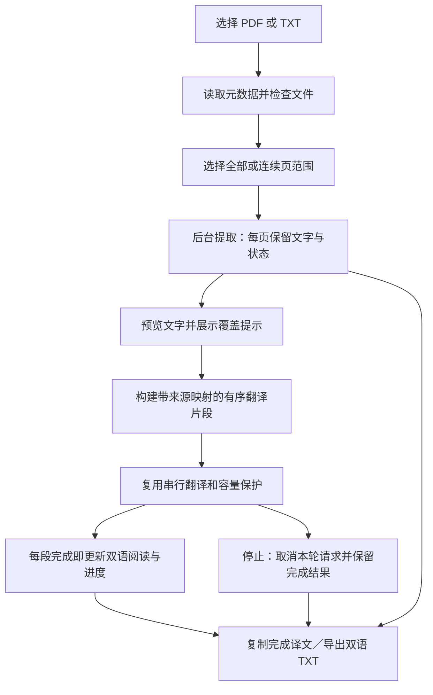

# 0.2.4 任务书：文字型 PDF 整篇翻译与双语阅读

日期：2026-09-26；交付更新：2026-09-27。状态：**本轮四项功能已实现并交付 0.2.4 / build 10，Swift 33 项通过；实际模型、UI 证据和未验证边界见 [开发记录](0.2.4文字型PDF开发记录.md)。**

本任务书定义下一轮的交付范围、实现路径和验收依据。任务编制时基线为 0.2.3 / build 7；下文保留原验收要求，实际交付状态以开发记录为准。常规技术选择可在实现时根据源码调整，但不得以静默漏页、漏段或扩大范围替代本任务书的要求。

## 1. 目标与范围

在现有「文档与图片」页面完成：

**选择文字型 PDF → 查看页数及提取预览 → 选择全部或指定页范围 → 自动分段翻译 → 按页双语阅读 → 导出完整双语 TXT。**

沿用英中/中英方向、已有本地模型以及停止操作。兼容 UTF-8 TXT 的全文翻译；TXT 无页码，使用原文段落编号和范围定位。

| 必交付功能 | 用户能做什么 | 完成标准 |
| --- | --- | --- |
| 文档提取预览 | 查看总页数、所选范围、逐页提取结果和风险提示 | 无文字、读取失败、尚未提取的页面不静默消失；能核对源 PDF |
| 全部／页范围翻译 | 对全部支持范围或指定连续页码启动一轮翻译 | 自动安全分段、逐段显示、明确进度、随时停止；不再逐行点击 |
| 按页双语阅读 | 按物理页码与段落顺序看对照，定位原 PDF 页 | 当前阅读位置不被新结果强制重置，长列表保持可操作 |
| 完整双语导出 | 保存所选范围的全部已提取原文和已有译文 | 文件名、总页数、范围、页码、提取问题和翻译状态可核对 |

### 本轮边界

- PDF 最低承诺为可提取文字的简单单栏材料；带图的页面可翻译已有文字层，但不能据此保证图片中的文字也被覆盖。
- TXT 最低支持 UTF-8，允许 UTF-8 BOM；其他编码明确报错，不静默用乱码替代。MD 保留现有提取入口，本轮不新增语法保护或完整 Markdown 排版承诺。
- 文档结果仅保留在当前窗口。停止后保留完成段；重新开始是新一轮完整翻译，关闭后不恢复。
- 既有 DOCX/PPTX、图片及 OCR 提取/选段入口保留原有能力与限制，不将其显示为已支持新的整篇流程。
- 暂缓扫描与混合扫描页 OCR、复杂双栏顺序还原、表格和公式结构还原、Office 整篇翻译、原排版 PDF/Office 导出、HTML 导出、截图、术语管理、资料库、持久化、续跑、单段和自动重试。
- 语音漏词、异常重复、时间戳及新的长时间语音回放继续暂缓。

## 2. 开发基线与交付约束

- 项目：`/Users/kevinzhu/Documents/ChatGPT/本地翻译器`。
- 已核对的实现 HEAD：`c4e12bd378caf47d3a3e5646ea9391ca3ba7e171`，分支 `codex/long-text-translation`，检查时工作区干净。
- 开发时重新检查工作区与远程，从**包含该实现及本任务书的最新开发提交**创建新的 `codex/` 功能分支，例如 `codex/pdf-document-translation`。本任务书创建时尚未提交，不能因硬切到上述实现 SHA 而丢失它。
- `main` 保留旧基线 `02f5508327699bfa1f5433bd3cd4dd3ed03d45fc`；不从旧 main 开发，不合并或覆盖 main。
- 当前应用：`dist/M0-20260924-131335-release/本地翻译器.app`，0.2.3 / build 7。下一轮目标 0.2.4，构建号至少 8；若届时已有新构建，则继续递增。
- 既有 Swift 22 项通过；这是上一轮证据，下一轮必须重新运行适用回归，记录实际数量。
- 复用本机 HY-MT2、Ollama、PDFKit 和现有 Swift 代码，不下载模型，不引入云服务或数据库。
- 延续既有公开上传授权，完成开发后仅上传源码、测试和文档；模型、原始文章/文档、真实测试全文、日志、导出结果、应用包及凭据不提交。使用忽略的 `artifacts/` 和 `dist/` 保存本地证据。

## 3. 已核对的源码与缺口

| 源码 | 当前状态 | 本轮如何接入 |
| --- | --- | --- |
| `Sources/TranslatorCore/DocumentImporter.swift` | PDF 默认只取前 10 页，`pageLimit` 上限 200；文字层主要按行返回；`auto` 遇到无文字会走 OCR；部分页失败可能被跳过 | 新增显式文字层提取路径，支持真实页码范围、逐页状态和完整原始提取文字；不在整篇流程中隐式触发 OCR |
| `Sources/TranslatorCore/Types.swift` | `ImportedDocument` 只有块与 warnings；`SourceRange` 有单页页码及可选坐标，没有完整页面清单 | 增加面向整篇任务的页面清单、范围及源映射，可使用独立新类型；保持旧 CLI/导入格式兼容 |
| `Sources/TranslatorCore/LongTextTranslation.swift` | 已有安全分段、串行调度、取消、UUID 隔离及导出；起点是单个字符串，没有 PDF 页语义 | 提取可复用的有序片段调度接口，或增加接收预分段输入的入口，保持文字页面原有行为 |
| `Sources/TranslatorCore/OllamaEngine.swift` | 单次容量校验、本机模型验证、正常结束/截断检查、请求取消、核对提示已具备 | 直接复用，不绕过预算与完成语义 |
| `Sources/TranslatorApp/AppState.swift` | 文档用 CLI 提取，仅翻译选中块，文档结果是块 ID 字典 | 增加独立文档任务状态和快照，连接提取、计划、逐段结果及导出；不要用旧字典冒充整篇进度 |
| `Sources/TranslatorApp/WorkspaceView.swift` | `DocumentWorkspace` 是选段列表，页数选项为“前 N 页”；选段提示仍写 8,000 字符 | 新增整篇/范围操作与逐页阅读；让选段输入也经过实际预算或安全分段，消除 UI 与引擎 2,048 字节预算不一致的问题 |
| `Sources/TranslatorApp/LocalTranslatorApp.swift` | 已有文字结果退出提示、录音等待收尾、关闭窗口返回保护 | 加入文档当次结果提示，保留录音及文字页面行为 |
| `Tests/TranslatorCoreTests/`、`scripts/swift.sh`、`scripts/package-app.sh` | 现有回归、构建与打包路径 | 新增来源映射、提取覆盖、调度与导出检查，递增版本并验收真实包 |

## 4. 推荐实现路径

### 4.1 从文件到译文的流程

页范围在开始提取前确定，提取后显示预览，再由用户点击翻译；不额外增加逐页确认弹窗。查看其他页面的原 PDF 不改变本轮翻译范围。

### 4.2 页面清单必须独立于翻译片段

建议新增 `DocumentTranslation.swift`，具体类型名可调整：

| 数据对象 | 至少保留的信息 |
| --- | --- |
| 文档快照 | 本轮 UUID、文件显示名、文件身份、总页数、选定范围、方向、模型、提取方式；必要的文件大小/修改时间或内容标识 |
| 页面记录 | PDF 物理页序号、可选印刷页标签、原始提取文字、提取状态、问题提示；每个选定页都必须有一条记录 |
| 来源片段 | 所属页、页内段/块编号、页内 UTF-8 原文范围；TXT 使用全文范围，不能伪造 PDF 页码 |
| 翻译片段 | 稳定 ID、有序来源片段列表、送入模型的文字、状态、结果、错误及核对提示 |
| 文档任务 | 提取阶段、翻译阶段、页面覆盖统计、片段计数、停止原因；导出使用同一份不可变快照 |

原始提取文字、用于阅读的段落和模型请求文字要能相互追溯。不要把所有页直接拼成大字符串后只保存一个起始页码，也不要把页码等结构标记塞进原文交给模型翻译。

### 4.3 显式页范围与容量保护

1. 先读取真实总页数。使用从 1 开始的 **PDF 物理页码**，可额外显示文档自身标签，避免封面/罗马数字导致混淆。
2. 允许“全部页”或一个连续区间，例如 3–12。检查空输入、非整数、倒序、越界；不能静默裁剪成别的范围。
3. 沿用现有 256 MB 文件保护；建议本轮每个任务最多 200 页。文件超过 200 页时，禁用“全部页”，明确要求选择不超过 200 页的区间。必须支持区间起点大于 200，例如 201–220，不能误用原有“只取前 N 页”接口。
4. 上述 200 页是任务数量保护，不是模型容量。每个翻译请求仍经过 `TranslationBudget`，当前最多 2,048 UTF-8 字节，提示/译文/余量也必须保留。
5. 文件读取、提取和分段在后台执行；页级更新进度并检查取消。PDFKit 提取对象由专用串行执行上下文持有，预览使用独立对象，避免跨线程共享可变 PDFDocument/PDFPage。
6. 切换文件或改变范围后，旧提取/翻译回调不能写入新任务；文件在处理期间被替换或删除，应保留已有结果并明确提示，不能把新的预览与旧结果混用。

### 4.4 提取覆盖与异常页

整篇新流程固定使用文字层，不调用旧 `auto` 的 OCR 回退。页面至少区分：待提取、已提取文字、未提取到文字、读取失败、停止未处理。

- “未提取到文字”可能是空白页、扫描页、只有图片或提取失败，不能直接断言为真正空白或确认扫描件。提示用户查看原页。
- 对有文字的混合页面保留“仅覆盖可提取文字，图片中文字未识别”的提示。检测不到扫描或复杂布局，不代表它们不存在。
- 加密锁定、损坏及无法读取的文件要在模型请求前明确失败。不做密码破解，也不以旧文件结果代替。
- 逐页保留失败原因。没有任何可翻译文字时不发送模型请求，显示“没有可翻译的文字”，不能显示完成 100%。
- 提取停止后，已提取内容仍可浏览及导出，未处理页必须列在覆盖说明中；本轮可要求重新提取完整所选范围后再启动翻译，不提供提取续跑。
- 新任务即使全部可提取文字译完，也只显示“所选范围的可提取文字翻译完成”，并同时显示存在的问题页。不能将此表述成 PDF 内容已无遗漏地翻译完成。

### 4.5 行、段落与跨页处理

现有 PDF 逐行模型请求不适合整篇阅读。建议在同一页内依据行间距、缩进、行位置和已有换行，保守组合相邻文字行；对标题、列表及不同区域保留边界，再用 `LongTextSplitter` 拆成有界请求。

原始提取文字必须保留。为模型合并行时可规范化用于排版的空白，但必须保留来源映射与规则；不能无记录地删词、删标点、合并真实重复、去掉页眉页脚或推断跨行断词。PDF 不存在可靠自然段标记，不承诺所有段落边界准确。

**本轮最低实现按页保持边界，不自动跨页拼句。** 跨页句子保留两页来源，阅读时能连续查看，提示跨页断句可能影响翻译。自动跨页合并及精细断词还原留待后续，避免把脚注/页眉拼入正文。验收重点是来源、内容和顺序没有静默丢失，不把跨页质量问题隐藏为已解决。

简单单栏材料按页内阅读顺序核对；复杂双栏/表格只保留现有提取能力与限制，不能用纯坐标排序宣称已修复所有阅读顺序。页眉页脚若进入提取结果，先保留；自动清理不作为必做项。

### 4.6 复用调度，保留文档来源

推荐给现有调度核心增加接收有序、已分段输入的能力，并让文字页面保留原有字符串入口。页码、来源范围和提取覆盖属于文档层；调度核心只负责片段顺序、状态、结果和取消。

每轮启动时固定文件/提取快照、范围、方向和模型。每段返回前同时检查本轮 UUID 与片段身份；确认正常结束、输入及结果匹配后，才提交完成状态。默认只发一个模型请求，不因文档页数增加并发。

保留既有独立错误继续、服务不可用停止调度、停止取消当前调用、旧结果隔离等规则。UI 的 busy、模型/方向禁用、停止快捷键要覆盖新文档任务；不能产生文档与文字请求相互覆盖。保留原有录音页面的生命周期，本轮不重做语音调度器。

建议页面覆盖与翻译进度分别展示，例如：

> PDF 共 24 页，范围 3–12；已提取文字 8 页，未提取到文字 1 页，读取失败 1 页。  
> 翻译共 36 段：完成 20、处理中 1、待处理 13、失败 2、中断 0。

翻译片段满足：总数 = 完成 + 处理中 + 待处理 + 失败 + 中断。无文字页不伪造为成功的翻译段；部分失败或覆盖异常不显示完全成功。

### 4.7 阅读界面

推荐在原文档页使用三个区域，而非新增独立产品页面：

- 顶部：文件名、总页数、范围、提取/翻译按钮、整体进度与覆盖提示。
- 左侧：页码及页状态列表；TXT 使用段落列表。
- 主区域：当前页逐段原文/译文对照，完成后增量更新；提供“查看原 PDF 第 N 页”。

用 PDFKit `PDFView` 的 SwiftUI 包装在应用内预览并 `go(to:)` 到物理页即可满足定位要求。矩形高亮、原文与译文像素级同步滚动不作为验收条件；原页预览与对照可切换，不要求同时塞入三个窄栏。

使用懒加载列表或分页，避免每次结果更新重建整份 PDF 视图。用户滚动、切页、查看完成译文不取消后台任务；新结果不得强制跳回第一页。切换模型、范围或文件时清除/隔离旧任务显示，并明确新开始将覆盖当前窗口中的旧结果。

### 4.8 导出与退出

最低交付 TXT，使用标准保存面板及系统覆盖确认。导出内容依次为：

1. 文件名、总页数、选定范围、方向、模型、提取方式与任务状态。
2. 提取覆盖汇总与问题页列表；范围外页仅注明“未选入本次任务”，不视为失败，也不必导出其内容。
3. 所选每一页的页标题、原始提取文字及有序对应译文。未提取到文字、读取失败、停止未处理页也有明确条目。
4. 每段失败、待处理、生成中或停止中断的标记及核对提示；不把生成中的内容当作完成译文。

对于提取失败页，无法凭空导出其原文，必须导出页码与“未获得原文”的原因。所谓完整导出，是**完整覆盖选定页面清单和已获得的原文**，不虚称还原了图片或无法提取的内容。

可复制本轮已有译文；复制和 TXT 来自同一任务快照。TXT 原文按来源范围去重拼接，避免因显示完整页和逐段原文而无意重复整页内容。空白和真实重复保留，不依赖字符串内容去重。

退出文案说明文档结果不自动恢复；加入已有窗口关闭保护，取消退出后仍能查看/导出。录音停止等待收尾、文字任务的退出行为和系统保存交互均须保留。

## 5. 实施工作包与检查点

| 顺序 | 工作包 | 实际产物 | 进入下一步前检查 |
| --- | --- | --- | --- |
| 1 | 范围与页面模型 | 页范围校验、元数据、页面清单、新数据类型 | 包含页 201 的区间正确；空页/错误页不丢记录 |
| 2 | 文字层提取与来源映射 | 显式提取路径、原始页文字、保守行组合、映射表 | 提取文字可按范围重建；不隐式 OCR；TXT 内容可核对 |
| 3 | 翻译计划与调度 | 预分段输入接口、文档控制器、取消与隔离 | 可控翻译器证明串行、部分失败、停止及新旧任务隔离 |
| 4 | 文档阅读交互 | 页列表、提取预览、逐段译文、原 PDF 定位 | 翻译中能滚动切页，定位正确，模型与范围锁定 |
| 5 | 完整导出与退出 | 文档 TXT/复制、覆盖清单、退出提示 | 完整/失败/停止/零译文均可导出，未处理页有标记 |
| 6 | 验证与交付 | 回归、有限本机推理、应用包、文档和 Git 提交 | 证据逐项对应验收表，无“代码存在即通过” |

建议新增小型 `DocumentTranslationController`、`DocumentTranslation` 核心类型及 `PDFPreview` 包装；命名和拆分可按实际代码调整。避免复制整套文字调度器后长期维护两套不一致的取消逻辑，也不为本轮搭建通用任务平台。

## 6. 验收矩阵

| 场景 | 必须观察到的结果 | 验证方法 |
| --- | --- | --- |
| 多页简单单栏 PDF | 正文和页面顺序正确，页数完整；可翻译全部提取文字 | 可重复生成的合成 PDF + 合法公开真实 PDF |
| 超过默认 10 页的文件 | 不再默认为仅前 10 页却标成全文 | 至少 12 页且末页含唯一标识 |
| 页范围 3–5／201–220 | 只处理对应物理页，正确显示全文件总页数 | 合成多页文件，注入可控翻译器，无需真实推理 220 页 |
| 反向、越界、超 200 页范围 | 明确拒绝或要求调整，无静默裁剪 | 核心范围测试及 UI 输入验证 |
| 跨行／跨页句子、标题、页眉页脚 | 原始提取内容和来源完整，不能误删或伪称跨页语义已解决 | 已知正文与重复行夹具；实际回看页面 |
| Unicode、重复句、长无标点段 | 来源可重建，每个请求有界，不丢真实重复 | 延续长文分段测试并加入页来源 |
| 空白、扫描、混合图文、复杂双栏页 | 无文字/布局/覆盖提示明确，无 OCR 隐式回退，无虚假全文成功 | 少量合成边界文件；检查页面清单和导出 |
| 锁定／损坏／中途失去源文件 | 明确失败或警告，保留已有快照，不混入其他文件结果 | 本地故障注入 |
| 部分完成时浏览与定位 | 完成段可读，能切页/滚动/定位到 PDF 正确物理页 | 最终应用 UI 实测 |
| 单段截断、服务不可达 | 无成功伪报；失败/待处理计数与导出一致 | 可控翻译器及已有流式协议检查 |
| 停止提取／停止翻译 | 不启动后续工作，已有原文/完成译文保留，其他部分有明确标记 | 自动取消检查 + 最终包实测 |
| 停止后立即换文件/范围/方向 | 旧回调不覆盖新任务，来源与结果不串页/串文件 | 故意迟到的可控响应 |
| 完整、部分、零译文 TXT | 每个选定页面均有覆盖记录，全部已提取原文可重建 | 对实际导出文件核对页码、范围、状态、原文与译文 |
| UTF-8 TXT 长文 | 不按单个超长块直接请求，不伪造页码，重复/空白有来源 | 含 BOM、Unicode 和重复段的合成数据 |
| 现有页面回归 | 0.2.3 文字长文、旧选段、停止/快捷键及退出行为不回退 | Swift 回归 + 针对性 UI 检查；不重跑语音长测 |

**原文完整性的判定分两层：** TXT 以解码后的输入文字核对；PDF 以保存的逐页原始提取文字核对，同时用已知内容夹具和原页预览检查提取质量。分段重建一致只能证明提取后没有再丢内容，不能证明 PDFKit 已读取 PDF 的全部可见内容。

## 7. 有限实机验证与交付

1. 运行 `bash scripts/swift.sh test`，记录实际测试数；旧的 22 项不能照抄为新版本结果。只增补有意义的范围、来源映射、覆盖、调度、导出和回归检查。
2. 用已有 HY-MT2 1.8B 对一份文字量超过 8,000 字符、至少 12 页的简单单栏 PDF 完成整篇翻译，实际检查末页、段落对应、原页定位与 TXT。可用合成材料控制正文内容和页序。
3. 另选一份合法公开的真实多页文字型 PDF 做有限范围翻译和人工提取核对，记录来源 URL、选择页数与局限；全文、下载文件与导出放在忽略目录，不入库。
4. 完成一次中译英短范围验证和一次中途停止导出。真实推理只用于证明完整链路；故障、超大页码区间及迟到回调优先用可控翻译器，不重复消耗模型。
5. 更新版本为 0.2.4、构建号至少 8，运行 `bash scripts/package-app.sh release`，检查签名、版本、包内构建对应关系，并在新包完成相关交互。临时签名及资源依赖限制继续保留。
6. 更新本任务书状态、README、总体规划的增量状态与 0.2.4 开发记录；严格区分自动检查、真实模型、UI 和尚未验证项。
7. 完成代码、测试和文档提交，上传新功能分支，核对本地/远程 SHA 和工作区状态。远程沿用 `https://github.com/DowndraftK/Local-translator.git`，必要时使用 `-c http.proxy=http://127.0.0.1:7897`；不输出凭据，不合并 main，不创建 PR。
8. 中文交付：实际功能、验证结果、已知限制、应用绝对路径、分支和提交。工程量随发现的问题如实报告，不用未验证的时间估算替代验收。

## 8. 后续开发启动说明

下一次开始开发时，先阅读本任务书、[0.2.3 开发记录](0.2.3纯文本长文开发记录.md) 和 README，再核对源码与工作区。旧[纯文本长文任务书](下一阶段-纯文本长文翻译任务书.md)是已完成历史任务，不能再次当作待实施范围。

任务书最初仅编制文档；后续用户已明确启动开发，现已完成第 5 节的范围模型、文字层提取、复用调度、阅读 UI、导出退出与交付工作包。验收证据分别覆盖核心自动测试、build 8 本机模型链路及最终 build 10 复核；复杂扫描/混合排版视觉专项、专业质量、7B、多机及完整断网未验收。不要把本任务书再次作为未开始的开发任务。
