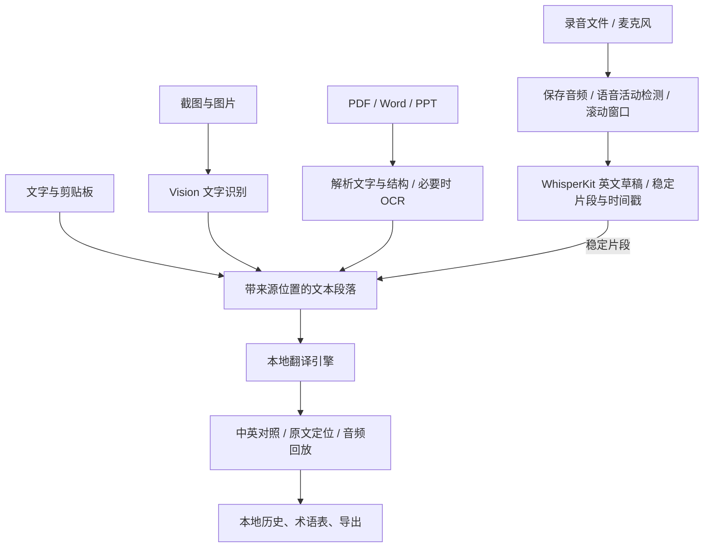

# 离线翻译器：产品与技术规划

版本：v0.5 规划稿  
日期：2026-09-15  
状态：M0 已完成本机模型集成和最小原生交互测试应用的打包；完整原生应用、麦克风实时字幕、真实课堂材料及完整离线验收尚未完成。进展见 [M0验证进展](M0验证进展.md)。

当前源码审查、未完成清单、优先级、实现方案和分阶段验收见 [剩余开发规划与解决方案](剩余开发规划与解决方案.md)。2026-09-15 重新构建及 11 项基础测试通过；本次更新为实施规划，不代表实时字幕或恢复功能已经实现。

本次已确认变更：仅供用户本人使用；文字翻译采用本地小模型，不依赖 Apple Intelligence；首个完整版本包含边录边显示的分句双语字幕，允许一定延迟。下文的文档元素覆盖表、实时延迟数值和资源阈值是待 M0 样本验证后锁定的建议，不是已通过的能力或性能承诺。

## 1. 已确认的需求

- 用途：出国留学，在没有网络时翻译英语文字、文档和录音。
- 使用者：仅用户本人；首版不承担公开分发、商业化、其他设备兼容和通用安装器的交付目标。
- 平台：支持用户当前的 Mac 和系统版本，不以跨平台或兼容旧版 macOS 为首版约束。
- 首个完整版本必须同时具备阅读、录音、文档翻译能力。
- 语音使用方式：上课时边录边显示分句英文和中文，允许一定延迟；同时保留录音导入、录后处理、回放、纠错及导出。
- 文档优先保证中英对照阅读、导出和来源对应关系。
- 功能范围聚焦翻译；排除理解与追问、长难句拆解、术语解释、补充背景、生成示例及课程资料问答。
- 默认英译简体中文，同时支持中译英和手动切换语言方向。
- 当前设备：国行 Apple M5 Pro / 48GB 内存；已安装 Ollama、Xcode。当前查验系统为 macOS 26.6.2，Xcode 26.6、Swift 6.3.3 可用。
- 文字引擎：Ollama + 本地小模型；不将 Apple Intelligence 或 Apple Translation 作为首版必需依赖。

产品定义：一款原生 Mac 离线翻译工具。软件和模型准备完成后，文字、截图、文档及录音都能在本机处理；用户可以回到原文、原页或原音频核对结果。

这里的“首版”指下述全部核心模块通过验收后的完整版本。开发过程中可以逐步交付内部测试版，但不以文字功能完成代替整个首版完成。

## 2. 首版核心功能

| 模块 | 用户操作与结果 | 实现方式 | 首版边界 |
| --- | --- | --- | --- |
| 文字翻译 | 输入、粘贴或拖入文字，获得中英对照，可复制、停止和重试 | Ollama 本地模型；按段落组织请求；流式显示 | 英中双向；长文自动分段；保留数字、单位、否定、条件和段落顺序 |
| 图片与截图翻译 | 粘贴/拖入图片，或框选屏幕区域；识别后翻译 | ScreenCaptureKit 截图；Vision OCR；共享文字翻译流程 | 保留识别文本和图片位置，允许纠正 OCR；图表和公式保留原内容 |
| 文档翻译 | 导入文档，按页/段落查看原文与译文，选择范围翻译或继续未完成任务 | PDFKit、Vision、Office 文件结构解析；统一文档分段模型 | PDF、DOCX、PPTX、TXT、MD；对照阅读优先 |
| 录音翻译 | 导入录音，或边录边查看分句双语字幕；生成带时间轴的英文与中文，点击片段回放 | AVFoundation + WhisperKit 本地转写 + 本地文字翻译；语音活动检测、滚动音频窗口和稳定文本提交 | 首版包含允许延迟的麦克风分句字幕及录后处理；暂定英文语音转简体中文字幕，不承诺零延迟或语音配音 |
| 离线准备与自检 | 清楚看到文字、OCR、语音是否可用，缺少什么、占多少空间 | 模型清单、实际加载测试、本地服务健康检查、分能力检查 | 不以“文件存在”替代“可推理”；缺失资源显示修复入口 |

### 2.1 文字翻译的输出约定

- 主视图展示原文和译文，提供复制、重试、纠错和来源定位。
- 保留原文中的金额、日期、学分、百分比、单位、网址、专有名词和条件关系。
- 允许用户设置偏好译法，例如将某课程中的 specific term 固定为指定中文术语。
- 术语表是约束和检查依据，不能把“已加入提示词”视为一定遵守。
- 输出忠实译文，避免擅自扩写、总结或补充原文未包含的内容。
- 译文的来源标记由程序绑定真实段落，不能依赖模型生成任意页码或引用。
- 不展示未经校准的“翻译准确率 98%”。OCR/转写可显示待核对片段，但模型自评分不是准确率。

### 2.2 文档支持范围

| 类型 | 提取办法 | 来源定位 | 首版注意事项 |
| --- | --- | --- | --- |
| 有文字层的 PDF | PDFKit 提取页面文字和位置，按版面组织段落 | 原文件页序号、可取得的页标签、段落及页面坐标 | 双栏、表格的阅读顺序需要专门验证，提供原页预览 |
| 扫描 PDF | 逐页渲染；对缺乏有效文字的区域/页面运行 Vision OCR | 原页和识别区域坐标 | 可先选择页范围；逐页处理，不一次将全部页面转成高分辨率图片 |
| DOCX | ZIPFoundation 读取 OOXML，Foundation XMLParser 解析正文、标题、表格等文字结构 | 标题路径、段落序号、表格单元格 | DOCX 没有稳定的内在页码；如需准确原页码，先从 Word 导出 PDF |
| PPTX | 按 presentation.xml 及关系文件确定幻灯片顺序；解析文本框、表格等文字 | 幻灯片编号、形状/文本块编号 | 不按 ZIP 文件名排序猜测页序；图片中的字需独立 OCR |
| TXT / MD | 本地文本读取与段落解析 | 行号或段落序号 | 代码块、链接等按约定保留，避免将代码误当普通段落重写 |

DOCX/PPTX 首版必须覆盖常见正文、标题、列表和表格文字；特殊嵌入对象、艺术字、复杂 SmartArt 和公式要明确标出未解析内容，不能悄悄漏掉。图片 OCR 的结果保留独立来源标记，避免与已有文字重复。

文档导出采用应用生成的双语版式：支持 HTML、PDF、TXT/Markdown。PDF 导出使用本地资源排版，带来源页/段落标记。首版不承诺生成与源文件排版一致的可编辑 DOCX/PPTX；旧版 DOC/PPT 可先另存为 DOCX/PPTX 或 PDF。

密码保护的 PDF 在确实需要时请求密码，仅用于当前读取；无法解析的加密文件显示明确原因。导入时不改写原文件。遇到缺字、异常顺序或提取失败，要允许查看原页、纠正文本和仅重试失败段落。

#### 2.2.1 文档边界的确定方法

以本人实际会使用的教材章节、论文、课件、校园通知和 Word 材料为依据，按“格式 → 内容元素 → 如何翻译 → 如何回查 → 失败怎么办”确定范围。先建立正常及复杂样本集，标出应提取的正文、表格和图片文字，M0 后锁定覆盖表；不只用文件扩展名定义支持程度。

建议的首版覆盖表如下。它细化已有格式范围，不取消 PDF、DOCX、PPTX、TXT、MD 的直接导入；尚未锁定的复杂元素行为需经样本验证。

| 内容类别 | 建议翻译范围 | 来源及展示 | 复杂情况与退路 |
| --- | --- | --- | --- |
| PDF 正文 | 可提取文字的标题、段落、列表；常见双栏正文；扫描及混合页中的清晰印刷文字 | 原页预览、页内多个文字区域、可纠正的阅读顺序 | 文字层乱码、图片区域漏字、复杂分栏时逐区域识别并提示核对；不可仅因文字层非空就跳过 OCR |
| DOCX 正文 | 标题、段落、超链接显示文字、常见编号及项目列表、常见表格 | 按章节和结构重排原文，保留段落及单元格定位；编号结合 numbering.xml 等定义解析 | 页眉页脚、脚注尾注、批注、修订、浮动文本框等逐项列为待验证元素；未覆盖时提示，需保留视觉内容时可由用户导出 PDF 再导入 |
| PPTX 正文 | 幻灯片标题、文本框、项目列表、常见表格；遍历支持的组合形状中的文本 | 按真实幻灯片顺序展示文本块，保存形状路径和坐标 | 备注、隐藏页、母版/布局继承、SmartArt 等明确策略；复杂视觉版面可由用户导出 PDF 后对照阅读 |
| 表格 | 普通矩形表格及经样本验证的常见合并单元格；翻译文本单元格，保留数字、单位和行列关系 | 保留表格结构、行列标题与单元格定位，不把整张表压成无结构长段落 | 嵌套、跨页、复杂合并和结构识别不可靠时保留原表区域/源文件入口，支持选区翻译；明确提示未完成结构化提取 |
| 图片、图表和公式 | 清晰图片中的印刷文字、图题、可独立定位的标签可 OCR 后翻译；公式本体和图形保持原内容 | PDF 保留原页区域；Office 可直接解码的内嵌图片保留图片；译文独立展示 | 不保证公式转 LaTeX、重画图表或替换图中标签；Office 无法渲染的对象显示类型和位置提示，可转 PDF 保留其外观 |
| TXT / MD | 正文、标题、列表和经样本验证的普通 Markdown 表格 | 行号/段落、双语重排 | 代码块、行内代码、链接目标和数学标记按规则保留；不执行嵌入 HTML 或远程资源 |

首版不以手写稿、严重模糊照片、任意复杂排版和全部 OOXML 特性为质量承诺。遇到已知未支持的结构必须标记；对于无法自动可靠识别的遗漏，提供原文核对和导入覆盖摘要，不声称能够自动发现所有漏字。

“回到原文”的首版含义：PDF 在应用内回到真实原页及区域；DOCX/PPTX 回到应用提取的原文结构及其段落/形状，同时保留打开源文件的入口。直接读取 XML 不等于实现 Word/PowerPoint 的原始页面渲染，也不承诺在外部 Office 应用中精确选中段落或形状。

双语导出遵循同一边界：已译块带来源标记；保留的图片或 PDF 裁切区域可嵌入 HTML/PDF；无法渲染的 Office 对象用来源标记和“未翻译/未渲染”提示，不能用空白造成已完整处理的错觉。TXT/Markdown 中无法嵌入的内容保留文字提示和来源标记。

### 2.3 录音支持范围

- 输入：优先支持 WAV、M4A、MP3；其他格式以 AVFoundation 能否解码为准，界面显示实际支持情况。
- 录制：麦克风开始、暂停/继续、结束和输入音量指示；仅在用户开始录音时启用麦克风。
- 录中字幕：边录边显示分句英文和中文；英文草稿可修订，仅把稳定英文片段提交翻译。中文翻译尚未完成时显示等待状态，不把未完成文字当作最终译文。
- 转写：默认指定英语，保留时间戳；支持用户纠正英文后重新翻译对应段落。
- 回放：点击文本片段，播放覆盖该片段的音频；可调整播放速度。时间范围以真实采集时间轴为准，合并片段后仍保留来源映射。
- 导出：英文、中文或双语 TXT/Markdown；SRT、VTT 字幕。
- 长音频：增量读取、分段处理、保存已完成进度；程序重启后从合理的分段检查点继续。
- 静音、重复片段、异常长输出和低质量输入需要检测，避免将转写幻觉当作真实语音。
- 录音原件与转写结果分别管理；用户可以保留文本、删除音频。
- 首版语音输入为麦克风或已有音频文件；系统播放声音采集、多说话人识别、自动会议录制和译文语音配音暂不纳入。
- “实时”定义为允许一定延迟的分句字幕：一段语音足够稳定后才输出中文，不承诺逐词同步、零延迟或同声传译级质量。
- 发生积压时显示当前落后时长，优先持续保存音频和处理字幕；可以暂停字幕处理并保留录音以便追赶。不得静默丢弃未处理音频来维持表面上的实时。
- 录制结束后继续完成尾段、去重及翻译，生成可回放、纠正和导出的最终双语记录。录中结果与最终修订结果分别管理。

英文语音必须先转写为英文，再调用文字翻译。Whisper 的 translate 任务主要用于转成英文，不能用它直接代替“英文语音转中文”。

## 3. 首版必要附加功能

| 功能 | 必要性 | 实现重点 |
| --- | --- | --- |
| 快捷入口 | 阅读时减少来回切换窗口 | 菜单栏入口、可配置全局快捷键、悬浮小窗；用户触发时读取剪贴板 |
| 本地历史与收藏 | 找回已翻译内容 | 快捷翻译历史可关闭；用户明确创建的文档/录音项目独立持久保存，支持恢复；搜索、收藏、删除、导出；记录来源与模型版本 |
| 翻译术语表 | 同一课程中术语译法一致 | 源词、偏好译法、课程标签、可选上下文；仅用于约束和核对译法 |
| 任务进度与恢复 | 文档和录音容易耗时或中断 | 分段完成状态、取消、重试、失败原因；避免重复保存结果 |
| 模型和资源管理 | 确保出国前准备完成 | 先支持固定资源集的本地导入、校验及真实加载自检；准备阶段可显式下载，失败可重试；显示占用空间和选定模型，不开发通用模型商店 |
| 数据与权限设置 | 控制本地文件和录音保存 | 清理历史/缓存/音频；按需申请屏幕和麦克风权限 |
| 结果核对 | 方便发现识别和翻译偏差 | 原文并排、原页定位、音频回放、识别文本修改 |
| 基础可用性 | 适合日常长期使用 | 中文界面、可调字体、深浅色、键盘操作、清晰的空状态和错误提示 |

系统英文朗读可以在首版收尾时加入，使用本机已安装语音；若缺少离线语音，资源页说明准备步骤。它不应阻挡阅读、录音、文档三条主流程的验收。

## 4. 技术栈决定

推荐：Swift + SwiftUI/AppKit + Ollama + HY-MT2 + WhisperKit + Vision/PDFKit + SQLite。

| 层次 | 选择 | 原因与职责 |
| --- | --- | --- |
| 平台与工具 | 当前 Apple Silicon Mac、macOS 26 系列；Xcode、Swift 6、Swift Package Manager | 自用优先，不为首版维护 macOS 15 回退；最终最低版本按实际采用的 API 和依赖确认 |
| 桌面界面 | SwiftUI；必要处用 AppKit | 主窗口、菜单栏、小窗、文件拖放、系统权限和快捷键整合 |
| 任务与状态 | Swift Concurrency、async/await、actor、明确的任务状态机 | 主线程只负责 UI；后台处理解析、OCR、推理与任务持久化 |
| 文字推理服务 | 已安装的 Ollama；URLSession 访问本机 API | 复用现有环境，支持模型切换、流式响应和加载状态 |
| 翻译模型 | 用户已安装的 HY-MT2 1.8B / 7B Q8_0 作为当前测试基线 | 按翻译保真、速度、内存和能耗选择，不评测聊天或知识问答能力 |
| OCR | Apple Vision 文字识别及 macOS 26 RecognizeDocumentsRequest | 在设备上运行；普通截图使用文字识别，复杂文档比较结构识别；保留坐标、候选、段落、列表和表格信息 |
| 截图 | ScreenCaptureKit + 原生区域选择界面 | 适配现代 macOS 权限与多屏；测试 Retina 缩放和坐标换算 |
| PDF | PDFKit | 本机预览、页面文字提取、渲染扫描页和来源跳转 |
| Office 文档 | ZIPFoundation + Foundation XMLParser | 直接读取 OOXML 的正文与结构，满足对照阅读需要 |
| 音频录制/解码/回放 | AVFoundation | 系统音频接口，统一采样格式和回放时间轴 |
| 语音识别 | WhisperKit 的开源库产品，Core ML 本地模型 | Swift 集成直接；选择明确的本地模型目录；不依赖付费 Pro 能力 |
| 数据 | SQLite + GRDB；小型偏好使用 UserDefaults | 历史、分段、词表、任务恢复；显式数据库迁移，便于检查和备份 |
| 导出 | 本地 HTML/Markdown 模板、原生打印/PDF；自建 SRT/VTT 序列化 | 双语排版和来源定位；所有字体与样式本地可用 |
| 验证 | Swift Testing / XCTest；关键流程用 XCUITest，模型结果人工评审 | 覆盖任务恢复、来源绑定、离线运行、取消和内容保真 |

初版直接做原生桌面应用。React/Tauri 更适合明确需要跨平台的场景，本项目当前使用原生 Apple OCR、音频和文档能力，采用 Swift 可以减少桥接与分发组件。Python 可用于短期评测脚本，运行应用无需用户维护 Python 环境。

文字翻译确定使用 Ollama + 本地小模型。按用户当前已准备的资源，第一基线改为 `hy-mt2:1.8b-q8` 与 `hy-mt2:7b-q8`，暂不要求额外下载 Qwen。1.8B 先作为低延迟候选，7B 作为质量比较候选；初筛已发现两者仍可能改变条件或遗漏限定词，不能仅凭参数量认定 7B 可靠。使用 HY-MT2 的提示格式和推荐参数，并加入数字、否定、时间条件与段落保真要求；提示词约束不等于质量保证。术语、跨段上下文和严重误译从 M0 就参与选型。默认模型须经真实材料验证，不将多引擎切换作为首版必需。

用户设备为国行。2026-09-13 查阅的 Apple 官方说明仍指出，中国大陆购买的支持设备目前无法使用 Apple Intelligence；不假定出国或修改地区即可解除购买地区限制。Apple Translation 的传统翻译路径与 Apple Intelligence 并非同一依赖，前者是否可用需另验，但按用户选择不再作为 M0 必测项。Vision、PDFKit、AVFoundation 和本地 Core ML/WhisperKit 路线不因此被排除。

OCR 的 M0 对比采用可靠文字层直接提取、Vision 基础文字识别、Vision 文档结构识别。Unlimited-OCR 仅在复杂材料存在明确质量缺口时加入评测；接入决策参考《Unlimited-OCR技术评估.md》，不因有新模型而默认增加额外运行环境。

## 5. 模块架构

内部按输入、处理、推理、展示和持久化划分。主模块建议为 AppUI、Ingestion、TextProcessing、ModelServices、Jobs、Persistence、Export，各模块先组织为清晰目录。当前 M0 图形界面通过短命工作进程调用 CLI；下一步语音会话建议由应用内采集服务和后台 actor 管理常驻模型，CLI 复用相同核心作评测。文档探针可在迁移期间保留工作进程，不把现有短任务进程直接当成长时录音会话。

定义可替换的 TranslationEngine、TranscriptionEngine、OCRService、DocumentImporter 接口。Ollama 作为初始翻译适配器；将来替换模型或接入 Apple Translation，不重写文档与录音流程。

### 5.1 统一的数据结构

| 对象 | 主要内容 |
| --- | --- |
| SourceAsset | 类型、名称、本地文件标识、内容哈希、导入时间 |
| DocumentBlock | 块类型、父块、顺序；段落/列表/表格/单元格/图片/公式等结构；提取支持状态 |
| TextSegment | 稳定 ID、内容版本、所属块、原始及清理后文本、语言、多个来源范围、原文变换映射、可选识别质量信息 |
| SourceLocation | PDF 页/多个坐标区域，PPT 幻灯片/形状路径，DOCX 标题/段落/单元格，音频全局起止时间；一个文本段可关联多处位置 |
| TranscriptRevision | 片段 ID、修订号、草稿/稳定/最终状态、原音频范围；录中字幕与录后修订的关系 |
| TranslationResult | segment ID 及原文版本、译文、模型与提示版本、术语及上下文版本、完成/截断/过期状态 |
| GlossaryEntry | 源词、目标词、课程/领域、可选说明 |
| ProcessingJob | 类型、源文件、阶段、已完成段落、错误、可恢复检查点 |

同一段原文修改后生成新的内容版本；旧译文标记过期。缓存键纳入原文、方向、模型、提示模板和术语版本，避免修改术语后错误复用旧译文。

如使用标题、表头或邻接段落作为翻译上下文，缓存键同时纳入实际上下文版本。保存时检查原文版本和任务运行标识，旧请求的迟到结果不得覆盖新修订。任务检查点、段落完成状态与结果持久化保持事务一致；音频先可靠落盘，再推进处理位置。

### 5.2 文字推理流程

1. 识别语言并允许手动覆盖，清理 PDF 断行等输入问题，同时保留原始文本。
2. 根据段落、标题和句子切分；为每段赋予稳定 ID 和来源范围；保留段落/单元格等结构，按需携带有限的标题、表头及邻接上下文。
3. 根据实际模型上下文窗口预算输入、术语和输出空间，不将整本书直接塞入一次请求。
4. 使用专用翻译提示模板，要求仅返回忠实译文；按模型验证生成参数、关闭可关闭的思考模式。当前 HY-MT2 基线采用模型卡参数（temperature 0.7），低随机性设置是待对照评测的候选，不是已确定默认。
5. 调用 `/api/chat`；正确解析逐行 NDJSON 流式响应、取消和最终完成状态。
6. 检查是否截断、段落遗漏、数字/单位或术语出现可疑变化；提示核对或重试，不伪造确定性。
7. 绑定源段落保存结果，再更新双语界面。

以上是 Ollama 适配器的实现流程。初始评测参数可从 `think: false`、约 8K 上下文、低 temperature 开始；具体参数按模型支持情况和实测调整。流式文字只作为正在生成的结果，检查结束原因和完整性后才视为完成，不能仅因收到 `done: true` 就把达到输出上限的截断译文保存为成功。实时字幕按稳定片段调用同一引擎，约束请求长度；有限上下文只用于翻译，不引入问答或总结。

原文被视为待翻译的数据；即使文档出现类似“忽略前面的指令”的句子，也不应改变任务。不向翻译模型提供文件写入、命令执行或联网工具能力。

### 5.3 语音流程

1. 麦克风采集时持续保存原始音频，使用有上限的内存缓冲；文件导入则增量解码。两者重采样到识别引擎所需格式，并维护同一全局时间轴。
2. 用语音活动检测（VAD）、静音和最大长度决定音频窗口；窗口保留少量重叠。连续讲话不能无限等待完整句号，应在经实测确定的最大窗口处提交可处理片段。
3. WhisperKit 使用明确本地模型和分词器转写；滚动结果分为可修订英文草稿和稳定英文片段。稳定判定结合端点及多次识别一致性，不能只用固定定时器或单次低置信度输出。
4. 根据全局时间和文本对齐处理重叠，避免重复和漏词；检测静音幻觉、循环输出和异常片段，允许用户纠正英文。
5. 稳定英文片段进入有界的翻译队列，携带有限上下文并绑定源片段版本；显示英文、待翻译状态及中文结果。草稿不反复触发完整翻译，减少中文闪动和重复推理。
6. 持久保存音频处理位置、稳定片段及翻译检查点。录制结束后处理尾段，必要时对低质量段落做录后修订；最终字幕保持可回放、可纠错、可导出。
7. 负载过高时显示落后时长并暂停低优先级文档工作；字幕队列保持内存有界，未处理音频保留在磁盘上。不以静默丢音频维持低延迟；可暂停字幕而继续录音，稍后追赶。

语音模型先比较 Whisper small.en 与 WhisperKit 支持的 large-v3-turbo 系列 Core ML 版本。前者作为轻量候选，后者作为准确度候选；取舍以口音、术语、噪声和本机速度实测为准。WhisperKit 官方仓库当前已整合到 Argmax OSS Swift，锁定经过验证的发布版本，只引入需要的 WhisperKit 产品。

WhisperKit 的默认初始化/下载策略不能直接作为严格离线保障。2026-09-13 查阅的主分支中，`download: false` 控制模型准备；`ModelUtilities.loadTokenizer` 在本地分词器缺失或加载失败后仍可进入 Hub 后备加载。当前已在固定依赖中删除该后备路径，升级时须重新审查。

当前接入采用范围明确的本地补丁：`ModelUtilities.loadTokenizer` 只读取显式分词器目录，本地读取或解析失败直接返回错误；`SpeechEngine` 以明确模型/分词器目录、`download: false`、`load: true` 初始化。源码快照和补丁见 [Vendor/README](../Vendor/README.md)。分词器与模型变体必须匹配；`strict` 等格式校验参数不能直接当作网络禁用开关。公开属性注入/扩展点方案保留为后续升级时的替代实现。

该补丁已编译，缺失/损坏分词器的本地失败检查通过；2026-09-14 已用两套本地 Whisper 资源完成加载与合成音频推理，2026-09-15 重新运行的基础检查也通过。空缓存、真正断网的新材料和运行过程外连审计仍待完成，不能将补丁测试等同于完整离线验收。另须把 GUI 每次重新生成哈希清单改成“准备阶段固定资源基线、运行阶段仅校验”，才能发现相对已验证资源的变化。

### 5.4 资源调度

- 同时只让一个重型文字生成任务使用默认模型。字幕运行时优先保证采集落盘、字幕转写和翻译；普通交互翻译使用短任务并遵守字幕时延预算；整篇文档和批量 OCR 为后台低优先级。
- 文档 OCR 与语音解码限制并发；长文件增量读取，避免一次占用过多内存。
- 语音模型与语言模型能否持续并行，使用本机基准确认；并行与交替处理都须满足持续采集的总吞吐，不能只比较单次任务速度。低优先级请求设定有界长度，在段落边界让出资源，必要时取消未完成请求并稍后重试。
- 模型按需加载，闲置后释放；应用启动不强制加载全部模型。录中字幕开始前预热所需模型，并在字幕会话期间保持加载，避免每句重新冷启动。
- 监测磁盘空间、取消、睡眠唤醒和服务中断，保留已完成段落。
- 不擅自结束用户已有的 Ollama 或其他任务；服务启动、复用和故障状态清晰可见。

## 6. 离线与数据要求

### 6.1 提前准备

安装时需要网络或可用的本地安装包，用来准备应用、Ollama、本地文字模型、WhisperKit 模型、与语音模型匹配的分词器及配置和可选语音资源。保留已验证的版本、文件哈希和可离线恢复的资源副本。首次加载/编译和真实推理测试也在出国前完成。

下载模型大小不等于运行内存；上下文缓存、音频和其他应用也会消耗内存。先安装一套文字模型与一套语音模型，预计为软件和模型预留 15–30GB，最终以选定文件清单为准，另计录音、原文和缓存空间。

### 6.2 运行时的离线规则

- 翻译内容、文档、截图和音频仅在本机处理；无云端回退。
- 应用推理请求只允许访问本机明确配置的回环地址，不开放局域网服务。
- 本机地址本身不能证明使用本地模型：只允许已验证的本地模型，并配置/验证 Ollama 的关闭云功能选项。
- Ollama 支持 `OLLAMA_NO_CLOUD=1` 或 `disable_ollama_cloud` 配置。接入现有安装时检查版本与配置，不静默覆盖用户其他配置。
- 离线工作模式下，不触发模型检索、自动模型下载、更新检查、外部网页字体或远程导出资源。
- 第三方独立应用的更新行为与本应用的请求策略分别检查；断网可用不等于自动证明整个系统零联网。
- WhisperKit 不采用可能自动搜索/下载模型的默认初始化路径；完整核查分词器及配置的后备下载路径。文件缺失或损坏时明确失败，不尝试隐式联网修复。
- 资源页分别显示文字翻译、语音、OCR 的准备状态；某项不可用不阻挡已可用的功能。

### 6.3 数据与权限

- 剪贴板只在用户点击或按快捷键时读取；首版不持续监听所有复制内容。
- 截图、录音分别在首次使用对应功能时申请必要系统权限。
- 原文件默认不改写；是否复制到应用资料库在导入行为中明确。持久访问用户文件使用系统支持的授权书签机制。
- 快捷翻译历史与显式保存的文档/录音项目分开设置：关闭自动历史不继续保存新的快捷翻译内容；用户创建的项目明确提示会保存原文/音频及检查点，以支持恢复，并提供独立删除入口。
- 数据库存储文本与任务索引，大型媒体单独保存；历史、模型缓存和媒体提供独立清理入口。
- SQLite 默认不等于加密数据库；首版依赖 macOS 用户账户和设备已有磁盘保护，不宣传独立数据库加密。
- 日志记录错误类别和耗时，默认不记录原文、译文、录音内容或文件密码。
- Office ZIP/XML 解析限制展开大小和路径，禁用外部实体/外部资源读取；不执行宏。

## 7. 界面信息架构

- 翻译：文字输入、截图/图片入口、中英对照、复制、重试和来源定位；另有轻量快捷小窗。
- 文档：文件列表、页/章节导航、原页/原文与译文、进度和导出。
- 录音：导入/录制、英文草稿及稳定双语字幕、落后时长和处理状态、播放器、时间轴、录后修订和导出。
- 资料库：历史、收藏与翻译术语表。
- 设置：离线准备、模型、快捷键、数据清理、权限帮助。

普通使用界面显示“翻译”“录音”“下载语音模型”等清楚的功能名称。端口、上下文长度和量化类型放在高级设置或诊断信息，不出现在必经流程。

## 8. 开发里程碑与完成标准

| 阶段 | 交付 | 进入下一阶段的依据 |
| --- | --- | --- |
| M0 技术验证 | 本地小模型的保真、术语及速度比较；WhisperKit 严格离线路径；麦克风到中文分句字幕的持续运行原型；PDF/Office/OCR 样本 | 验证真实使用价值；记录严重错误和人工修正成本；锁定可用模型/资源，确定格式边界，证明字幕延迟及积压可控后再进入完整实现 |
| M1 共同基础与阅读 | 原生界面、默认模型接入、双语翻译、结构及多来源映射、版本化任务/数据库、词表基础、固定资源清单和自检、文件/权限策略、快捷入口 | 可取消、可重试、可恢复；来源不丢失；旧结果不覆盖新原文；清楚区分历史与保存项目 |
| M2 文档完整流程 | OCR、PDF/Office 导入、页段对照、范围翻译、进度恢复、双语导出 | 样本文档顺序可核对、缺失可见、重启后能继续 |
| M3 录音完整流程 | 录制/导入、录中分句双语字幕、负载及积压处理、录后修订、时间轴回放、纠正、字幕导出 | 长录音及持续字幕稳定，端到端延迟可测且积压可控，时间轴、静音、尾段和中断正确处理 |
| M4 首版收尾 | 完善术语/历史/资源及权限界面、联合验收、当前 Mac 上的稳定安装与启动 | 阅读、文档、录中字幕和录后处理全部通过验收，才作为首个完整版本交付；不以公开分发工程为前提 |

以上保留各里程碑的能力定义，不将 M2/M3 归为可选功能。根据当前已有原型和用户实时需求，下一轮实际顺序调整为：最小 M1 任务/数据基础 → 完成 M0 实时链路验证并优先推进 M3 → 补齐 M1 阅读和 M2 文档 → M4 联合验收；文档样本与翻译质量初筛从第一轮开始。具体依赖和人日粗估见 [剩余开发规划与解决方案](剩余开发规划与解决方案.md)，M0/S2 验证后重新估算日程，当前不承诺未经验证的交付日期。

实时字幕已纳入首版，M0 必须提前做持续采集验证，不能到 M3 才首次验证模型能否跟上语速。先前基于录后处理范围的工期估算不再直接适用；自用减少分发工作，实时字幕增加流式状态、调度和长时验证，两者须分别估算。

## 9. 首版验收与评测

以下是计划中的验收要求，尚未执行，也不是当前性能承诺。

| 范围 | 验收办法 |
| --- | --- |
| 离线 | 完成安装和模型准备后，断开外网并重启应用；用此前未处理过的文字、文档和录音完成翻译与导出，避免缓存掩盖依赖 |
| 服务与资源 | 模拟 Ollama 未启动、模型/分词器缺失或损坏、空缓存、磁盘不足、权限拒绝；必须给出明确状态；联网但处于离线工作模式时也不隐式下载 |
| 内容保真 | 使用校园通知、课程要求、生活说明、学术段落、术语及上下文样本；分别记录改变含义的严重错误、影响理解的一般错误和表达问题；人工检查数字、否定、条件、术语、遗漏和错误补充；不得擅自转为问答或总结 |
| 文档定位 | PDF 页码、PPT 页号、Word 段落都能回到原内容；双栏、表格、扫描件和图片文字有专门样本 |
| 音频全流程 | 麦克风/文件 → 解码 → 转写 → 翻译 → 保存 → 回放/导出；覆盖清晰英语、口音、真实课堂距离与噪声、静音、术语、60–90 分钟长录音；核对英文和中文及人工修正成本；内存有界 |
| 录中字幕 | 记录语音片段结束到稳定中文显示的端到端延迟、中位数/P95、当前落后时长、重复/漏句和草稿修订；持续运行时积压不持续增长，过载有可见状态和保存退路 |
| 恢复 | 文档/录音处理中停止、服务断开、应用退出后重开；已落盘音频及完成结果保留，重试不重复；迟到结果不覆盖修订；录音遇睡眠/设备中断须标记缺口，不假装连续录到声音 |
| 导出 | 离线打开导出的双语 PDF/HTML 与 SRT/VTT；中文字体、长段分页、时间戳和来源标记正确 |
| 数据控制 | 关闭快捷翻译历史后不继续保存对应新内容；显式保存项目的持久化行为清晰；删除任务能按选择清理结果和音频，不误删原文件 |
| 交互 | 运行重任务时仍可操作；取消后界面约 1 秒内确认取消，后台释放时间另行测量 |

M0 先用约 30 条文字初筛，再建议扩充至 100–200 条有代表性的双向、术语及上下文样本。文档按上文覆盖表准备每类正常及复杂样本，并人工标注应出现的内容和顺序。语音包含短音频、一段 60–90 分钟长录音，以及真实或接近课堂条件的持续麦克风输入。可先用公开或合成材料排错，选型前须纳入用户实际会使用的材料；测试样本数量不等于统计准确率保证。

性能记录冷启动、预热后首字和完整译文耗时、语音处理实时率、音频到中文的总耗时、字幕端到端延迟、峰值内存、持续负载、能耗与人工修正时间。录后处理须计入解码、转写、翻译和保存，不能只报转写耗时。

候选目标：“预热后 100 英文词普通段落约 10 秒内完成”；录中字幕可先测试“普通语句结束后约 5–15 秒显示稳定中文”。这些数值尚未获得用户确认或本机验证，应在 M0 按真实语速、准确度和延迟分布调整。另记从片段开始到中文显示的延迟，避免长窗口造成等待却被结束后计时掩盖。持续处理须整体跟得上输入并留出余量，平均吞吐合格仍不能代替对 P95 延迟和积压趋势的检查。

## 10. 后续扩展

- 更低延迟的逐词/短语级字幕：在首版分句字幕基础上另行评估稳定性、修订频率和能耗；不以当前首版承诺同声传译体验。
- 系统播放声音采集：ScreenCaptureKit 音频流，与麦克风输入分开配置；不是开启麦克风就能保证清晰获取电脑声音。
- 原排版译文文件、更多语言、Windows、说话人区分等：按后续实际需求单独评估。

首版架构保留替换接口，但不提前引入向量数据库、云端账户、同步服务或自训练模型。

## 11. 已核对的技术来源

- [Ollama Chat API](https://docs.ollama.com/api/chat)：流式生成、think、format、keep_alive 等能力。
- [Ollama FAQ](https://docs.ollama.com/faq)：本机绑定地址、关闭云功能、本地与云模型行为。
- [Qwen3 8B 模型页](https://ollama.com/library/qwen3:8b)：可用模型、量化版本与下载体积。
- [腾讯 Hy-MT2 1.8B 模型卡](https://huggingface.co/tencent/Hy-MT2-1.8B)：2026-09-14 核对 1.8B/7B 提示格式、术语指令及推荐生成参数；当前采用用户已安装的 Q8_0 权重。
- [WhisperKit / Argmax OSS Swift](https://github.com/argmaxinc/argmax-oss-swift)：Swift 本地语音能力、模型、增量读取与默认下载行为；实现时固定已验证版本。
- [Apple Vision 文字识别](https://developer.apple.com/documentation/vision/recognizing-text-in-images)：设备内 OCR、文字坐标和语言配置。
- [Apple RecognizeDocumentsRequest](https://developer.apple.com/documentation/vision/recognizedocumentsrequest)：macOS 26 起的文档结构识别。
- [Apple ScreenCaptureKit](https://developer.apple.com/documentation/screencapturekit)：屏幕和音频采集。
- [Apple Intelligence 可用性](https://support.apple.com/zh-cn/121115)：2026-09-13 查阅，说明中国大陆购买设备当前受限；规划不依赖这一能力。
- [Apple TranslationSession](https://developer.apple.com/documentation/translation/translationsession) 及 [highFidelity](https://developer.apple.com/documentation/translation/translationsession/strategy/highfidelity)：传统系统翻译与 Apple Intelligence 路径的区别，仅作技术背景，不再是首版必测引擎。
- [WhisperKit 分词器加载](https://github.com/argmaxinc/argmax-oss-swift/blob/main/Sources/WhisperKit/Utilities/ModelUtilities.swift)、[初始化及扩展点](https://github.com/argmaxinc/argmax-oss-swift/blob/main/Sources/WhisperKit/Core/WhisperKit.swift)：2026-09-13 查阅主分支，本地失败后的 Hub 后备加载及 tokenizer 注入/加载扩展点；实施须锁定版本并重新验证。
- [GRDB](https://github.com/groue/GRDB.swift) 与 [ZIPFoundation](https://github.com/weichsel/ZIPFoundation)：数据库和 Office 容器解析的依赖候选，实施前固定版本与检查兼容性。

## 12. 下一步

M0 已开始采用可运行程序实施，入口和运行命令见根目录 [README](../README.md)。目前完成编译、基础自动检查、合成文档/OCR 样本，且已经接入本机 HY-MT2 / Whisper 资源进行实际推理。当前重点是检查文字条件保真、语音窗口边界和双语完整处理耗时；真实课堂质量、麦克风实时字幕及长时离线验收仍未完成，不将短样本跑通等同于 M0 完成。

2026-09-15 源码审查后的近期任务：固定源码与资源基线；建立最小项目库，先保存英文再独立翻译；实现可恢复的滚动分句和尾句；接入用户主动开始的麦克风及最小双语字幕 UI。具体代码入口、17 个工作包和验收矩阵见 [剩余开发规划与解决方案](剩余开发规划与解决方案.md)。

开展 M0 技术验证：先验证严格离线资源加载、本地小模型的术语及保真表现、持续麦克风到分句中文字幕的完整链路，以及实际课程文档的提取范围。将选定模型、字幕延迟/积压、人工修正成本、离线检查和格式边界回写本规划。只有真实材料上的质量和等待成本可接受，才据此安排完整首版工期。
