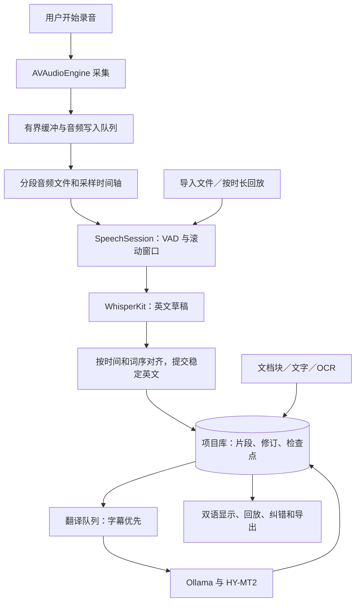

# 本地翻译器：剩余开发规划与解决方案

日期：2026-09-15  
基线：当前工作区源码、产品规划 v0.4，以及「审查产品技术规划可行性」对话中的最终需求。  
文档性质：源码审查后的实施方案；2026-09-17 已完成部分录音工作包，最新状态见下面的增量表。其余章节保留 09-15 审查基线，候选性能门槛尚未全部通过实测。

## 2026-09-22 / 09-23 增量进展

0.2.2 已实现 VAD 前置保留、独立录音落盘、暂停/继续、识别检查点恢复、字幕分页和资源观测。最新 Python 45 项、既有 Swift 14 项回归通过；实体麦克风环境音暂停/继续已核对样本数，真实模型管道暂停与进程异常恢复已通过。

09-23 完整 60 分钟原速重复 TED 测试已结束：57,600,000 样本一致、841 次翻译全部完成、无持续积压、交换空间始终为零。发现 9 个纯标点字幕，修复后重放 4,846 个已保存事件，剩余 832 段的文字和时间完全不变。五次完整重复的英文 WER 为 3.33%–8.31%，仍有漏词、异常重复、时间戳回退及中文质量风险；内存后半程也仍缓慢增长。**本次仅完成重复材料下的稳定性核查，T04/T07/T15 的真实课堂与质量验收未完成。** 用户随后决定暂缓语音漏词修复，下一轮转为纯文本长文翻译。完成项与限制以 [0.2.2 开发记录](0.2.2录音与恢复开发记录.md) 为准，下面保留历史进展。

### 已确认的下一轮范围（2026-09-23）

只推进文字翻译页面的四项能力：**长文自动分段、逐段显示译文、整体进度、完整双语导出**。文字任务自动保存/重开恢复、历史任务、检查点、单段重试及自动重试暂缓；当前窗口的进度、已完成结果和停止操作保留。文档/OCR、术语、快捷阅读等仍在总体规划中，不并入这轮。任务准备阶段不启动功能开发。

具体边界、源码入口、验收与交付要求见 [下一阶段任务书](下一阶段-纯文本长文翻译任务书.md)；新对话可使用 [开发启动提示词](下一阶段-开发对话启动提示词.md)。以下历史工作包和估算不覆盖此次缩小范围的用户决定。

## 2026-09-17 实施进展

本轮交付为 0.2.1 流式字幕测试版，说明与证据见 [流式字幕与 TED 实测](流式字幕与TED实测报告.md) 和 [运行环境](../runtime/README.md)。实时路线已改为原生 AVAudioEngine 采集、Python 常驻会话中的 MLX 编码 / MPS 解码 / SimulStreaming；旧 WhisperKit 路线保留作对照。

| 工作包 | 本轮实现与验证 | 尚未完成的验收 |
| --- | --- | --- |
| T01 数据基础 | 录音任务 SQLite、源修订、翻译任务、事务提交、请求租约；重复事件与旧请求覆盖检查通过 | 全应用统一资料库、数据库迁移、完整历史浏览 |
| T02 固定资源 | 流式加载前校验固定源码和模型清单；MPS 不可用明确失败 | 所有能力统一自检；完整断网与外连审计 |
| T03 独立翻译与恢复 | 英文先持久化，中文独立失败/重试；测试工作进程被中断后不重译成功片段 | 任意 ASR 位置续跑、系统崩溃/磁盘满/迁移恢复 |
| T04 稳定英文 | 接入 SimulStreaming 确认输出；自有分句保留缩写、小数及真实重复；EOF 提交 | 真人 TED 已发现流式漏词，质量验收未通过；录后 MLX 校对明显改善，但不能替代实时修复 |
| T05 麦克风 | 原生采集、连续采样转换、有界发送、WAV 落盘、权限说明、停止排空 | 实体麦克风允许/拒绝权限、设备断开、睡眠、独立录制与暂停继续 |
| T06 最小字幕 UI | 英文先显示、独立中文、积压提示、任务打开；11 分钟 TED 完整双语链路已跑通 | 长课堂、内存/能耗、吞吐余量和实际麦克风延迟 |
| T07 真实材料 | 官方 TED 视频及英文稿；流式与录后识别对照，明确记录漏词及条件误译 | 多口音/课堂噪声/多人语料，中文人工量化评审；BBC 尚未成功获取 |
| T09 录后流程 | 时间点回放、倍速、英文修改与补译、TXT/SRT/VTT；独立录后校对版保留原版 | 完整修订历史、字幕时间人工对齐、播放器兼容验收与术语上下文 |
| T16 自用交付 | 原生新界面、应用内 Python 代码、递增版本、签名验证与使用说明 | 模型/运行环境仍依赖项目目录；移动资源、更新权限身份和四条主流程联合验收 |

自动检查不能代替识别质量：本轮 24 项 Python 检查及 12 项 Swift 测试通过，长 TED 流式仍有漏词。T08、T10–T15 的完整首版工作没有因此被标为完成。

## 1. 结论与范围

项目已具备可继续开发的 M0 基础：原生窗口、本地翻译接口、文档提取探针、录音文件处理、依赖离线补丁与自用打包。当前仍处于技术验证阶段，距离日常可用的完整首版，主要缺口是稳定分句、实时录音、持久化与恢复、完整文档阅读，以及真实材料质量验收。

建议保留现有 Swift/SwiftUI、Ollama/HY-MT2、WhisperKit、Vision/PDFKit 路线。实施顺序调整为：**固定可复现基线 → 最小任务与数据基础 → 修复语音分句并实现实时字幕 → 完善翻译质量和录后流程 → 文档完整流程 → 快捷阅读与资料库 → 联合验收。** 文档样本收集和质量初筛从第一轮开始，完整文档开发在实时技术风险被验证后推进。

沿用已经确认的约束：

- 仅供本人在当前 Mac 使用，采用本地小模型，不依赖 Apple Intelligence。
- 首版包括阅读、文档、麦克风分句双语字幕和录后复习；允许字幕延迟。
- 默认英文语音转英文，再翻译为简体中文；文字支持英中双向。
- 保留 PDF、DOCX、PPTX、TXT、MD 直接导入。导出采用应用自己的双语版式。
- 公开分发、云服务、系统声音采集、说话人识别、原排版 Office 回写、问答与总结维持后续或范围外定位。

这份方案中的阶段是可分别验收的内部交付，并不缩减完整首版的既定功能。

## 2. 本次核查及证据

已读取引用对话中的各次用户需求和最终结果，检查 `Sources` 下全部应用与核心源码、测试、脚本、固定依赖说明，以及现有产品与 M0 报告。源码缺口优先以当前文件为准；历史性能数字仅作为历史证据引用。

本次重新执行：`bash scripts/swift.sh test`。Debug 构建成功，Swift Testing 的 **11 项测试全部通过**。XCTest 外壳打印的“0 tests”不代表没有执行后面的 Swift Testing 测试。日志见 [本次基础测试](../artifacts/audit-20260915-swift-test.log)。

这些检查覆盖本机地址限制、响应结束与截断、XML/Office 基础解析、简单来源定位、内容核对提示，以及缺失/损坏分词器的本地失败路径。尚无应用层任务恢复、实时采集、重叠分句、导出及长时运行测试。本次没有重新执行模型质量评测、麦克风采集、断网审计或界面交互验收。

### 2.1 能力现状

| 模块 | 当前真实状态 | 完整首版仍缺什么 | 主要代码证据 |
| --- | --- | --- | --- |
| 原生应用与打包 | 已有四个页面及自用 `.app` 打包脚本 | 持久任务驱动的界面、稳定录音权限、版本与构建追踪 | `TranslatorApp`、`scripts/package-app.sh` |
| 文字翻译 | 本地模型英中双向、复制/保存、终止与错误检查 | 长文分段、界面流式输出、上下文预算、纠错、词表界面 | `OllamaEngine.translate`、`AppState.translateText` |
| 翻译质量 | 历史样本已发现严重条件误译 | 真实材料评审、可重复参数对照、默认配置与风险提示 | [M0模型联调报告](M0模型联调报告.md) |
| 图片/OCR | 可以选择图片文件并提取文字 | 粘贴/拖放、区域截图、位置叠加、OCR 修改 | `DocumentImporter.imageDocument` |
| PDF | 文字层、逐页 OCR、结构识别探针 | 混合页、段落合并、双栏顺序、原页高亮、范围任务 | `DocumentImporter.pdf` |
| DOCX/PPTX | 有正文/表格段落及正确 PPT 页序 | 列表、单元格结构、形状定位、图片 OCR、特殊对象摘要 | `OfficeImporter.extract` |
| TXT/MD | UTF-8 文本按空行切块 | 代码/链接/公式保护、长块切分、行号映射 | `DocumentImporter.extract` |
| 文档翻译与导出 | 单个选段翻译及 TXT 对照 | 整篇/范围翻译、进度恢复、HTML/PDF/Markdown | `AppState.translateBlock`、`DocumentWorkspace` |
| 导入录音 | 分窗口识别、逐片段中文、TXT 导出 | 整句提交、英文先保存、回放/纠错、SRT/VTT、续跑 | `SpeechEngine.process`、`AppState.processAudio` |
| 麦克风字幕 | 应用尚未接入 | 采集、原音频保存、常驻模型、草稿/稳定状态、尾句与积压 | `AudioWorkspace` 仅有导入入口 |
| 资源与离线 | 本地模型检查、分词器补丁、哈希工具 | 固定资源基线、真实加载自检、完整离线验证 | `SpeechResources`、`OllamaEngine`、Vendor 补丁 |
| 历史/恢复/术语 | 术语参数只在 CLI 可用；任务结果在临时目录 | SQLite 项目库、修订与检查点、搜索/收藏/删除、词表管理 | `Types.swift`、`AppState.makeWorkFolder` |
| 快捷阅读与可用性 | 应用内快捷键与基本中文界面 | 全局快捷键、菜单栏、悬浮窗、字体设置及系统权限引导 | `LocalTranslatorApp.swift` |

### 2.2 可以直接保留的基础

- 本地端点校验、拒绝 HTTP 重定向、验证本地模型元数据、拒绝截断成功的处理。
- WhisperKit 严格本地分词器加载补丁及固定源码快照。
- PDFKit/Vision 和 OOXML 的基础入口、PPT 页序处理、ZIP/XML 读取约束。
- SwiftUI 窗口、文件选择、明确的限制提示，以及 CLI 评测入口。
- 对导入文件采取增量音频读取的方向；媒体无需一次全部读入内存。

## 3. 需要优先处理的具体问题

优先级定义：P0 阻挡可信的录音/恢复或技术验收；P1 属于完整首版必须交付的能力；P2 是首版收尾和维护改进。优先级低不代表从首版删除。

| 编号 | 优先级 | 现状与影响 | 解决方案及验收 |
| --- | --- | --- | --- |
| R1 | P0 | `SpeechEngine.swift:113` 固定 15 秒独立切块，`:149` 对每个 ASR 片段立即翻译；历史退款条件样本被拆坏 | 引入滚动重叠窗口与稳定整句提交。退款句、跨窗口数字/否定、重复语句样本无人工标注范围内的漏词、重复或条件拆错；中文再单独评审 |
| R2 | P0 | `SpeechEngine.swift:149–156` 等翻译成功才回调保存英文；翻译异常会退出当前处理，已识别的当前片段没有检查点 | 先事务保存稳定英文与待翻译状态，再独立调用翻译。模拟翻译超时后，英文仍可查看，其他可处理内容可继续，该段可单独重试 |
| R3 | P0 | `AppState.swift:138` 使用临时目录；`Main.swift:85–88` 写部分结果但没有恢复读取路径 | SQLite 保存任务、片段、处理位置；媒体保存在应用支持目录。停止/退出/重开恢复，不重复写入，不覆盖新修订 |
| R4 | P0 | 麦克风、音量状态、原音频落盘和尾句均未接入；打包信息也未声明麦克风用途 | 在应用进程采集、保存音频；补 `NSMicrophoneUsageDescription`。通过权限拒绝/允许、停止尾句、设备断开和短录音测试 |
| R5 | P0 | `AppState.swift:145` 用单一 `busy` 串行阻挡所有操作；每次工作进程新建语音实例 | 独立录音会话、转写 actor、单并发翻译调度；会话内复用模型。慢翻译不阻塞采集、字幕滚动或结果查看 |
| R6 | P0 | `AppState.swift:218–220` 每次录音先重新 seal，再对刚生成的清单校验；无法据此发现相对“以前已验证版本”的静默文件变化 | 准备阶段生成并保存资源基线，运行时只校验基线；资源更新须重新准备和真实加载。复制测试资源后改动字节，应失败而不是重建为通过 |
| R7 | P1 | `DocumentImporter.swift:48` 中 auto 模式只要文字层非空就跳过 OCR；图片区域可能遗漏。文字层按行翻译也会拆段 | 对文字质量/区域覆盖做分流，保留按页/选区强制 OCR；组合段落后再翻译。混合页中标注的正文和图片字均能回查 |
| R8 | P1 | `imageDocument` 将结构识别 transcript 存成一个块；表格等仅留在原始 JSON。PDF 点坐标与 OCR 归一化坐标共用无类型的 `rect` | 将结构结果映射为层级块；来源显式保存坐标系、页面大小/旋转和变换。测试双栏、旋转页及裁切图像的高亮 |
| R9 | P1 | 语音只保留 `TranslationRecord.translation`，丢弃内容警告、模型/提示版本；现有数字提示也查不出“收到/提出”的差别 | 共用完整 TranslationResult；语音和文档展示核对提示。加入语义评审与来源修订，保留模型 digest、提示与参数 |
| R10 | P1 | 单片段输出后重写完整 `.partial.json`；UI 每 500ms 重读完整数组，停止时没有最后一次统一导入 | 以增量数据库事务和事件通知更新 UI；停止完成后查询已提交结果。大任务写入量随新增片段增长，已提交结果不会仅因轮询间隔漏出现在导出中 |
| R11 | P2 | Git 当前尚无提交，产品规划仍有“离线补丁尚未编译验证”的过时描述 | 先整理并提交源码/测试/文档基线，继续忽略模型与私人样本；本次先同步规划描述，后续每个可验收功能单独提交 |

R2、R5、R6、R10 为本次源码控制流审查结论，尚未逐项做故障注入复现。当前输入和方向控件在忙碌时已禁用，因此“用户修改原文后旧结果覆盖”是引入编辑/并发前必须防范的架构缺口，不应误报为已经复现的界面错误。

## 4. 实施架构：复用核心，补齐会话与任务层

首版建议将麦克风采集放在应用进程，WhisperKit 由后台 actor 持有；CLI 继续调用同一核心进行可重复的文件/回放测试。原有短命工作进程适合探针，但语音会话需要明确的常驻生命周期和事件输出。迁移按功能进行，现有文档探针可在任务层接入完成前保留工作进程。

建议新增的职责边界（名称是实施建议，并非已有模块）：

| 文件/组件 | 职责 |
| --- | --- |
| `AudioCaptureService` | 设备与权限、采样、音量、分段写入、设备中断通知 |
| `SpeechSession` actor | 模型准备/复用、增量解码、窗口与全局时间；统一文件/麦克风输入 |
| `TranscriptAssembler` | 对齐、去重、草稿修订、稳定提交、强制切分和尾句收尾 |
| `TranslationScheduler` actor | 单一重型生成、字幕优先、上下文预算、重试和版本检查 |
| `ProjectStore` / `JobCoordinator` | SQLite 事务、任务状态、检查点、媒体引用、恢复与删除 |
| `DocumentNormalizer` | 多来源段落、阅读顺序、表格/列表结构和 OCR 变换 |
| `ExportService` | HTML/PDF/TXT/Markdown/SRT/VTT，共用来源与完成状态 |
| 按页面拆分的 ViewModel | 订阅任务事件，发布界面状态，不承担文件哈希和模型加载 |

第一轮只实现实时字幕所需的最小接口和存储表。SQLite/GRDB 按原规划引入并固定版本；当前 `Package.swift` 尚未包含它。依赖准备与离线运行验收分开。保留上游 Swift 5 兼容模式期间，也要明确跨 actor 的所有权与可发送数据，不能依赖新增 `@unchecked Sendable` 来绕过并发设计。

## 5. 实时录音的具体解决方案

### 5.1 采集、准备与保存

1. 明确状态：未准备 → 准备中 → 可开始 → 录音中 → 暂停/继续 → 停止采集并收尾 → 已完成/可恢复失败。字幕翻译错误是片段状态，不直接等于录音失败。
2. 在开始字幕会话前校验资源并预热 Whisper/HY-MT2；显示真实阶段。模型就绪后由用户主动开始录音。准备失败可重试，不进入假录音状态。
3. 采集回调只把样本复制到预分配的有界队列；不在实时音频回调中执行模型推理、数据库操作或同步磁盘写入。专用写入队列尽快保存原音频。
4. 以短分段 CAF/PCM 文件保存录音，并记录分段是否写入完成；后续可提供压缩副本。数据库只推进到已安全写入的音频位置。磁盘写满或写入队列无法跟上时明确停止/标记缺口，不丢样本后仍显示正常。
5. 时间轴以实际采样计数和设备时钟建立，不用模型局部时间戳或系统日期承担主时钟；设备变更、暂停、睡眠分别记录会话区间和缺口。
6. 按采样率/通道/编码实测空间预算。16 kHz、单声道、16-bit PCM 理论约 115 MB/小时；48 kHz、单声道、Float32 约 691 MB/小时，尚未包含其他结果和文件开销。不能默认所有原音频都按前者占用。

### 5.2 稳定英文与中文提交

- 初始试验参数可采用约 1 秒刷新、12–20 秒观察窗口、2–3 秒重叠、0.5–0.8 秒静音端点；这些是调参起点，不是已确定的体验承诺。
- VAD 只回答可能有声音/语音，不单独决定自然句结束。结合标点、停顿、前后两次词序一致性与词级时间对齐，保持窗口尾部可修订。
- 对齐必须同时使用时间与文本；同一句话重复说两次不能被纯字符串去重删除。时间均转换到同一会话全局采样位置。
- 稳定部分先存为带版本的英文；未完成尾部留作草稿。检测到句界后提交翻译，必要时在稳定的分句处切开。
- 连续长句设最大等待/窗口预算。到预算仍无句界时，在可接受的分句处提交并标记上下文未完；下一窗口保留有限上下文，最终阶段可替换为合并修订。长句不能无限等待，也不能把任何强制截断当作完整句。
- 保存翻译时核对 `segmentID + sourceRevision + runID + contextVersion`。修订后返回的旧中文可保留作历史证据，但不覆盖当前结果。
- 停止采集后仍需转写磁盘上的最后样本、提交尾句、完成待翻译片段及最终事务。界面区分“已停止录音”和“仍在生成最终结果”；用户可保留进度后退出。

### 5.3 对 WhisperKit 流式类的使用决定

固定版本的 `AudioStreamTranscriber` 可作为原型和算法参考，但不能直接当成完整会话管理器：

- 它读取 `audioProcessor.audioSamples`，本身未调用 `purgeAudioSamples`；默认处理器持续 append，长会话的缓冲裁剪和偏移换算仍需应用负责。
- 它的 confirmed/unconfirmed 划分主要根据保留多少末尾 segment，不等于完整自然句的质量判定。
- `stopStreamTranscription()` 只切换状态并停止采集，没有完整的尾句与翻译收尾流程。

推荐复用 WhisperKit 底层转写接口，应用自己管理有界窗口和 `TranscriptAssembler`。短原型可对照上游类的结果；若使用上游类，必须同时解决缓冲裁剪后的 `lastBufferSize`、确认时间偏移与重启状态，不能只清空数组。

### 5.4 积压与资源调度

将“已录到哪里”“ASR 已稳定处理到哪里”“中文按顺序连续完成到哪里”分别记录。跳过静音时也推进处理位置，避免把静音错误计为积压。

- 重型文字推理并发先限制为 1；字幕优先，普通短文字次之，整篇文档最低。文档在段落边界让出资源。
- 内存只保留近期音频窗口和有上限的待处理任务描述。未处理音频/英文在磁盘或数据库中，不因队列满被丢弃。
- 初始过载阈值可用连续约 30 秒积压作告警试验；先暂停后台文档、降低草稿刷新率，再进入“持续录音、稍后补齐字幕”。记录实际阈值与触发效果后再锁定。
- 不自动切换未验证模型。模式切换与延迟状态可见；翻译服务离线仍继续录音并保存英文，重连后有限重试。
- 翻译和 ASR 能否持续并行要实测。平均实时率小于 1 只是必要条件，还需要余量、P95 延迟和内存趋势合格。

## 6. 持久化、恢复与资源基线

### 6.1 最小数据结构

| 对象 | 第一轮应有的字段 |
| --- | --- |
| SourceAsset | 稳定 ID、类型、名称、内容指纹、受管理文件或授权书签 |
| Segment | ID、资产/父块、顺序、原始/清理后文本、语言、内容版本、多个 SourceLocation |
| SourceLocation | 页/形状/单元格或采样区间；坐标系、变换、页面尺寸及旋转 |
| TranscriptRevision | 段 ID、修订号、draft/stable/final、ASR 来源范围、待核对原因 |
| TranslationResult | 段与原文版本、方向、模型 digest、提示/参数/术语/上下文版本、结果与警告、状态 |
| ProcessingJob | ID、runID、阶段、可恢复状态、错误与重试次数、ASR/翻译检查点 |
| AudioChunk | 会话、分段文件、全局采样起止、完成写入位置、录制缺口 |
| ResourceProfile | 模型变体、分词器匹配、依赖版本、文件相对路径/大小/SHA-256、最后加载结果 |

SQLite 记录结构和任务；音频、图片与原文附件存到 `Application Support/LocalTranslator` 下的项目目录。临时目录用于可删除的中间文件。旧 M0 临时结果可提供显式导入入口，通过校验识别格式和源录音，不自动把所有临时文件都视为项目。

### 6.2 事务与恢复规则

1. 先写入媒体，再提交“已持久化媒体位置”；数据库不能宣称处理到了尚未落盘的音频。
2. 保存稳定英文与翻译队列条目使用同一事务；中文结果和该段完成状态也用同一事务。
3. 重启将遗留 running 作业转为 interrupted；核对源文件指纹和资源版本后从合理重叠边界继续，用稳定 ID/版本保证重复执行不重复写入。
4. 翻译失败保留英文和错误；只重试待处理/失败段落。文件消失或变更时请求重新定位/确认版本，不悄悄接续到另一份输入。
5. 关闭应用前停止采集并完成写入收尾；紧急退出后的最大可能损失范围取决于最后写入的缓冲，需通过故障测试测量并说明。
6. 用户纠正原文会增加版本、使旧译文过期，并更新受影响的上下文缓存。不要因为模型名称相同就复用旧参数或旧词表结果。

### 6.3 资源准备和自检

资源状态至少区分：未配置、文件存在、清单校验通过、实际加载成功、固定短样本推理成功。OCR、语音、文字各自报告，不用 Ollama 可连接代替所有能力可用。

把现有 `seal` 限定在显式准备/更新阶段。运行时对保存的可信基线校验；失败只提供重新选择、恢复备份或重新准备入口。清单使用相对路径便于移动资源目录，加载前解析真实路径并校验范围。保存本地基线只能发现相对基线的变化，不能单凭它证明模型上游来源真实性。

模型及分词器变体匹配还需配置检查和真实加载/推理测试。对程序创建的 Ollama 保持 `OLLAMA_NO_CLOUD=1`；复用已有服务时显示“已确认本地模型”和“服务全局配置是否可确认”两个事实，不静默修改用户服务。元数据校验若做会话缓存，应绑定 digest，并在服务重启或模型变更时失效。

## 7. 文字质量、分段与术语方案

1. 建立有审查标注的回归集：首批约 30 条实际通知/课程/生活材料，再扩充到 100–200 条双向材料。重点覆盖至少/至多、之前/之后、收到/寄出、每天/每次、否定、统计限定、术语、表格及原文中的指令式文字。
2. 分开评估 ASR 英文是否正确与中文是否忠实。使用错误英文的中文结果不能单独用于模型排名。
3. 对现有 1.8B 与 7B 比较官方参数和低随机性候选；每条关键样本重复至少 3 次，记录配置/seed（若支持）和结果。降低 temperature 可能减少变化，不保证修复含义错误。
4. 输入预算由实际 token 空间决定：提示、术语、上下文、原文和预留译文总量不超模型窗口。按自然段/句子拆分，过长段再细分，并保留与原始范围的映射。
5. 跨段只携带有限且明确标为上下文的标题、表头或前段；要求只翻译当前目标段，不能把辅助上下文重复输出。
6. 数字/单位/日期归一化用于核对提示；否定和条件提示用于突出审查范围，不生成虚假的“已验证正确”结论。7B 可作为人工触发复核候选，但两模型一致也不代表正确。
7. 术语表支持课程标签、启停、增删改和版本；先筛选本段相关条目。采用偏好译法和偏差提示，不做全局强制字符串替换。
8. 用 `AsyncStream` 或等价事件接口将 `onText` 接入界面；生成中与已完成有不同状态，只有正常结束并通过完整性检查才保存成功。取消仍保留可辨认的未完成状态。

质量记录包括严重错误、一般遗漏/术语错误、表达问题、总耗时与人工修改时间。建议把关键通知回归集的已知严重误译设为发布阻挡项；“这批样本没有严重错误”仍然不等于总体准确率保证。如果两套模型都未达标，再评估更换模型；当前首要工作不是继续扩大下载范围。

## 8. 文档完整流程与格式边界

所有格式共用：导入覆盖摘要 → 结构化原文 → 选择页/章节/块范围 → 翻译队列 → 原文核对/修改 → 失败重试/恢复 → 双语导出。摘要列出已提取文字、表格、图片、明确未支持对象与尚未处理范围。

| 格式 | 实施内容 | 最小验收材料与结果 |
| --- | --- | --- |
| PDF 文字层 | 行合并为段落；保留断行/连字符清理映射；基于区域组织双栏顺序；PDFKit 原页和高亮 | 普通页、双栏论文、旋转/裁切页各有标注；文字对应区域与阅读顺序正确 |
| 扫描/混合 PDF | 文字层质量与覆盖检查、图像区域 OCR、重叠去重；手动页/选区强制 OCR | 有页眉文字但正文为图片的混合页不能只得到页眉；扫描页来源可定位 |
| Vision 文档结果 | 把段落、列表、表格映射为块，不只保存 transcript 或原始 JSON | 表格文本与行列关系可查看、翻译及导出；不能可靠映射时明确降级 |
| DOCX | 解析标题层级、numbering.xml 的列表编号、表格行列与常见合并单元格、内嵌图片关系 | 正文/列表/表格/图片的标注内容可回查；脚注、修订、文本框等有明确处理或未覆盖提示 |
| PPTX | 保留现有真实页序，新增形状/组合路径与坐标、项目列表、表格和图片 OCR；定义隐藏页与备注策略 | 页序与形状来源正确；隐藏页/备注不被无说明地跳过或混入正文 |
| TXT/MD | 标题/列表/段落及源行号；用语法解析保护代码块、行内代码、链接目标和数学标记 | 译后代码/URL/数学标记保持；长段可拆分；嵌入 HTML 和远程资源不执行/加载 |
| 图片/截图 | 粘贴、拖放与框选；保存原图和 OCR 位置；允许修改识别文本 | Retina/多屏/缩放的选区与识别区域一致；修改只重译相应块 |

PDF 页范围从“前 N 页”升级为可选起止页和必要的分段任务；移除 200 页上限前先验证分页任务和资源上限。大文档仍逐页/逐块处理，扫描件不要一次生成全书高分辨率图片。

DOCX/PPTX 的原始视觉渲染继续按既定边界处理：应用展示提取后的原文结构并可打开源文件；视觉复杂材料可由用户先导出 PDF。公式/图表本体保留原内容，无法渲染对象给出位置和未渲染提示。加密 PDF 若确有使用需求，增加仅在当前读取中使用的密码入口；其他不可解析加密文件说明原因。

Unlimited-OCR 保留为条件候选：只有原生结构识别对实际复杂样本存在明确缺口，且对照证明额外质量收益超过维护和资源成本时才接入。沿用 [既有评估](Unlimited-OCR技术评估.md)，当前不把增加 OCR 模型列为关键路径。

导出先共用本地 HTML 双语模板，再生成 PDF；TXT/Markdown 保留来源与未翻译说明。HTML 转义原文，不嵌入远程字体/资源，PDF 检查中文字体、长段分页、表格跨页和图片。未完成任务允许导出，但须标明未翻译/失败范围。

## 9. 录后复习、快捷阅读与数据控制

- 回放：用 AVFoundation 播放器按全局时间定位片段，支持暂停/倍速。单元格/多段来源和音频合并片段的边界都来自应用数据。
- 纠错：修改英文增加源版本，仅重译受影响段；录中稳定版与最终版分别保留，界面明确当前显示哪个版本。
- 字幕：SRT 使用毫秒和逗号，VTT 使用毫秒和点及标准头；处理时间单调、最小持续时间、长文本换行、双语行布局和未完成范围。用实际播放器验证。
- 快捷入口：菜单栏、可配置全局快捷键、悬浮双语窗；只在用户触发时读取剪贴板；截图权限按功能申请，取消选区不新建空任务。
- 历史/收藏：搜索、收藏、删除、导出；快捷翻译历史可关闭。显式创建的文档/录音项目独立保存，支持恢复，不受“关闭自动历史”误删。
- 清理：应用管理的音频、结果、临时缓存和模型资源分开列出；删除项目不得误删用户原文件。文件移动后可通过书签/重新定位恢复访问，按最终沙盒策略使用对应书签类型。
- 可用性：字体调节、深浅色、键盘焦点、明确错误恢复入口；长任务中仍能核对已完成结果。系统英文朗读使用本机已有语音，可放在首版最后。
- 自用交付：固定 bundle ID、递增构建版本，记录模型/依赖/数据库 schema；验证移动应用和资源目录后的启动。无需把公开签名/公证作为自用首版前置，但需在真实打包应用里验证麦克风权限身份与更新行为。

## 10. 可执行任务清单

下表列出完整工作包与完成标准；最新部分实施状态见文首 2026-09-17 增量表。每项交付包含实现、必要自动检查及可重复验收记录，未满足全部标准的任务不标为完成。

| ID | 优先级 | 工作包 | 前置依赖 | 完成标准 |
| --- | --- | --- | --- | --- |
| T00 | P0 | 固定源码/测试基线，保存依赖与构建信息，整理非私人回归样本 | 无 | 可回到同一源码版本并复现 11 项基础检查；模型/私人内容不入库 |
| T01 | P0 | Segment/Revision/Job、SQLite 最小表、资产与任务目录 | T00 | 同一结果重复提交不重复；旧 runID/源版本不覆盖当前结果 |
| T02 | P0 | 固定资源清单与分能力自检 | T00 | 正常可加载；缺文件/坏文件明确失败，运行时不重新 seal |
| T03 | P0 | 英文先保存、独立翻译与恢复检查点 | T01 | 翻译失败保留英文；重开可续跑，只补未完成部分 |
| T04 | P0 | 可重放输入、滚动窗口、稳定分句和时间对齐 | T01、T03 | 退款条件与跨边界/重复/静音/长句样本通过对齐检查；中文单独核对 |
| T05 | P0 | 原生麦克风、分段落盘、设备/权限/暂停状态 | T01、T02 | 不启模型也能可靠录制并回放；拒绝权限和断设备状态明确 |
| T06 | P0 | 常驻语音会话、字幕翻译队列和最小实时 UI | T03、T04、T05 | 5–10 分钟自然英语完成双语显示；尾句保存；记录积压和延迟 |
| T07 | P0 | 首批真实材料和模型/参数对照 | T00；后续复用 T04、T06 | 有审查样本、严重错误与修正成本记录，可说明候选取舍 |
| T08 | P1 | 长文预算、流式 UI、上下文与术语表基础 | T01、T07 | 超长输入可分段；终止/截断不冒充成功；术语变更使旧缓存失效 |
| T09 | P1 | 音频回放、英文纠错、最终修订、SRT/VTT | T03、T06、T08 | 点击片段回放；纠错只影响对应版本；播放器可加载字幕 |
| T10 | P1 | 来源类型/结构块、PDF 原页与混合页处理 | T01、T08 | 标注 PDF 中正文/图片字/表格来源可回查；未支持范围可见 |
| T11 | P1 | DOCX/PPTX 结构及图片，TXT/MD 保护 | T10 的统一块模型 | 覆盖表的正文/列表/表格/图片样本通过，特殊对象明确处理 |
| T12 | P1 | 范围/整篇翻译、文档恢复和双语导出 | T03、T08、T10、T11 | 中断重开不重做已完成块；HTML/PDF/文本离线导出可读 |
| T13 | P1 | 图片粘贴/拖放、区域截图与 OCR 纠错 | T08、T10 | 多屏缩放定位正确；OCR 修改生成新版本 |
| T14 | P1 | 菜单栏、全局快捷键、小窗、资料库和数据控制 | T01、T08；复用 T09、T12 | 可快速翻译与找回内容；历史关闭/删除/媒体保留规则通过 |
| T15 | P0 验收 | 真正断网、资源异常、60–90 分钟与恢复测试 | 各功能存在后分批执行；最终依赖 T06、T09、T12、T14 | 第 11 节适用项通过，失败有修复与复测记录 |
| T16 | P2 | 自用打包更新、字体/键盘/空状态、版本与备份说明 | 上述任务 | 真实 `.app` 在本机重启、移动、更新后仍可用；四条主流程全部验收 |

### 10.1 阶段交付与粗估

以下为单人熟悉 Swift/macOS、复用现有原型的工程量估算，包含局部测试；不是开发日历、自动化完成时间或已承诺工期。真实材料收集、需要用户在场的录音验收和系统环境问题会影响日历跨度。

| 阶段 | 主要任务 | 可拿到的结果 | 粗估人日 |
| --- | --- | --- | ---: |
| S0 基线 | T00，开始 T07 样本收集 | 可复现版本、已知错误回归材料 | 1–2 |
| S1 可靠基础 | T01–T03 | 先保存英文、任务续跑、固定资源自检 | 5–8 |
| S2 实时最小闭环 | T04–T06，初轮 T15 | 可主动开始/暂停/停止的 5–10 分钟双语字幕；尾句与积压可见 | 10–16 |
| S3 翻译和录后阅读 | T07–T09 | 参数取舍、长文/术语、回放纠错与字幕导出 | 6–10 |
| S4 文档完整流程 | T10–T12 | PDF/Office/TXT/MD 范围翻译、核对、恢复和导出 | 12–20 |
| S5 快捷阅读与资料库 | T13–T14 | 截图、小窗、历史收藏、数据清理 | 6–10 |
| S6 联合验收与交付 | T15–T16 | 真实材料、长录音、离线、恢复、自用包 | 7–10 |
| 合计 | 含上述工作，未另计风险余量 | 完整首版 | 47–76 |

按每周 5 个有效人日换算，约 10–16 个全职工作周；再为语音边界、复杂文档和系统问题预留约 25%–30%，可按约 12–20 周级别理解规模。该范围由本次剩余工作包粗估得出；S1/S2 完成后应重估，不能沿用旧对话中未含实时能力的排期作为交付承诺。

### 10.2 下一轮最先做的五件事

1. T00：建立可回退源码基线，并把现有跨 15 秒退款句加入带人工标注的回归材料。
2. T01/T03：最小项目库与“英文先保存、中文独立失败/重试”；先用导入文件验证恢复。
3. T02：把资源准备和运行校验分开，固定当前两套 Whisper 的资源配置。
4. T04：同一音频以不同输入块大小回放，验证稳定分句、时间轴与尾句的一致性。
5. T05/T06：接入主动麦克风和最小字幕界面，完成第一次 5–10 分钟自然英语验收。

第一轮关键成果应是“发生故障也能保住录音/英文，并能继续补出可信来源的字幕”。这一基础同时减少后续文档任务、词表和导出返工。

## 11. 验收矩阵与通过条件

### 11.1 自动检查与故障注入

| 验收项 | 场景 | 必须观察到的结果 |
| --- | --- | --- |
| 分句/去重 | 退款跨界、数字和否定跨界、相同句重复两次、长停顿、无停顿、纯静音、停止时半句 | 对人工标注范围不漏/不重；真实重复保留；尾句只提交一次；不凭静音编造内容 |
| 输入一致性 | 同一音频按不同长度输入块、批处理、按时长回放 | 全局时间映射一致，稳定内容不因任意输入块边界被截坏 |
| 翻译失败 | 本地模拟服务超时/断连/截断，单段模型错误 | 英文先保存；明确失败；限定重试；其他可处理内容与录音仍继续 |
| 版本 | 翻译中修改源文本/词表，模拟旧请求迟到、任务重复提交 | 当前结果只对应最新源版本和有效上下文，重复执行无重复数据 |
| 恢复 | 正常停止、退出、测试进程异常终止、数据库迁移、源文件移动/变更 | 已提交结果可恢复；音频检查点不超前；缺失输入需重新定位 |
| 媒体可靠性 | 设备断开、暂停/继续、睡眠、磁盘写满、写入队列受压 | 显示中断/缺口，保留已写入内容；不把未知区间标成连续录音 |
| 资源 | 缺失/坏分词器、权重改字节、变体不匹配、空缓存 | 正常本地加载或明确失败，无隐式下载，不自动覆盖资源基线 |
| 文档 | 每种受支持结构的标注材料、图像文字、加密/坏包、旋转/多栏 | 来源/顺序可核对；未知结构有摘要；原文件不被改写 |
| 导出/数据 | 超长中英、表格、未完成任务、字幕边界、关闭历史/删除媒体 | 离线可读/可播放；完成状态真实；不误删原文件 |

故障注入优先使用临时副本、模拟服务和受控测试进程。不能为验证服务中断而结束用户共用的 Ollama，也不能破坏当前唯一模型副本。

### 11.2 实际使用验收

- 先 5–10 分钟自然英语，再至少一段 60–90 分钟接近课堂距离、口音和噪声条件的录音。短合成材料保留作回归，不能代替课堂质量结论。
- 分别记录预热/冷启动、首个草稿、稳定英文、中文显示、落盘和最终导出的时间。端到端耗时包含界面发起、资源校验和准备，不能直接沿用 CLI 中不含前置 seal 的字段代表点击后的等待。
- 延迟同时记录从片段开始和从经核对片段结束到中文显示的时间；报告样本数、中位数和 P95。不要用 4 个片段推导可靠 P95，也不要将模型估计时间戳当成人工真值。
- 初始候选目标：预热后普通 100 英文词段落约 10 秒内完成；普通语句结束后稳定中文中位数约 5–10 秒、P95 约 15 秒。必须由真实数据和用户体验再确认；长句按最大等待预算单独报告。
- 持续任务报告 ASR/翻译实时率、当前积压和分时段趋势。候选吞吐目标可留约 20% 余量，即完整处理实时率约不高于 0.8；并行流水线还需直接测量实际积压，不能简单累加不同阶段 CPU 时间。
- 监测应用与 Ollama 的峰值/稳定内存、系统内存压力、swap、能耗。音频缓冲和待处理队列有硬上限；UI 分页读取历史，避免整个转写永久堆在内存。固定模型预热后不应出现随录音时长持续近线性增加的音频缓冲占用。
- 记录严重误译和每 10 分钟录音的人工修正分钟数，与当前使用方式做对照。测试集无已知严重错误和修正成本可接受，才支持选定默认模型。
- 完成资源准备后，在用户可控的无外网条件下重启并使用新材料完成文字、文档、录音及导出；另在联网环境审计应用/子进程和本次使用服务的外连尝试。两种证据分开记录。
- 测试界面约 1 秒内确认取消；采集停止、最后媒体写入和后台模型释放分别记录，不因界面按钮恢复就判为后台已结束。

只有阅读、文档、录中字幕、录后处理及数据恢复的适用验收项全部通过，才将当前 M0 系列升级为完整首版。

## 12. 规划维护

本次同步修正主规划中已经过时的离线补丁状态、HY-MT2 参数描述和工作进程过渡安排，并在 README 增加本方案入口。历史 M0 实测报告保留当时日期与结论，作为证据，不修改成新的测试结果。

每次交付按 T 编号记录：实现位置、样本/测试命令、通过与失败、已知限制。需求边界变化写回 [产品与技术规划](产品与技术规划.md)，实际验收结果写入对应阶段报告；不能只更新“已完成”字样而缺少验证证据。
